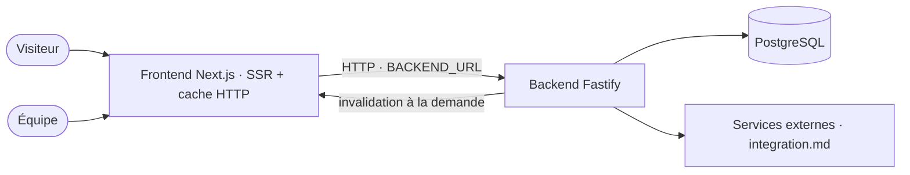

# Architecture

## Stack

- TypeScript de bout en bout, pnpm. Deux applications indépendantes sous `src/`, chacune avec son `package.json`
- Frontend : Next.js (App Router, Server Components), Tailwind, next-intl
- Backend : API REST Fastify, Prisma, PostgreSQL

## How it fits together

## Key decisions

- Le backend seul possède Prisma et la base ; le frontend passe toujours par l'API HTTP
- Pages publiques en SSR avec cache HTTP (`s-maxage=3600, stale-while-revalidate=60`, l'accueil à `s-maxage=300` — RG-003), invalidées à la demande depuis l'admin via `/api/revalidate` ; pages authentifiées en hybride SSR + SPA
- Le frontend joint le backend par `BACKEND_URL` (`http://backend:4000` en local), figé dans `routes-manifest.json` **au build** : le changer exige un redéploiement sans cache
- `fetchAPI` (`src/frontend/src/lib/api.ts`) sépare « absent » (404 → `null`) et « cassé » (`BackendUnavailableError`). Les confondre a mis en cache un 404 pendant une heure sur une ressource qui existait (#345) — détail dans `.claude/rules/error-handling.md`
- Sponsors et speakers sont des entités partagées entre éditions ; ce qu'une édition a affiché est figé sur la participation (#129, #351, #375)
- Les tâches planifiées tournent dans le processus backend (`node-cron`, `src/backend/src/lib/scheduler.ts`) : correct tant qu'il n'y a qu'un réplica
- SEO : Schema.org (Event, Organization, Person, Article), Open Graph, images OG dynamiques ; les métadonnées d'une page passent par `pageMetadata()` (`src/frontend/src/lib/page-metadata.ts`)
- Objectifs non négociables : Lighthouse ≥ 90, Core Web Vitals, WCAG 2.1 AA — `docs/objectifs-techniques.md`

## Gotchas

- Next **remplace** le bloc `openGraph` d'un layout au lieu de le fusionner : une page qui en déclare un perd `og:site_name`, `og:locale` et `og:type`. Un test interdit `openGraph:` dans les pages (#384)
- Les heures du programme passent par `formatEventTime` (`src/frontend/src/lib/datetime.ts`), en `Europe/Paris` explicite : le conteneur tourne en UTC. La saisie admin (`isoToLocalInput`) lit encore l'heure du navigateur
- Pièges de l'environnement local : `testing.md` § Local environment
