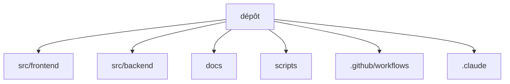

# Codebase Map

## Areas

- `src/frontend/`: site public (`src/app/[locale]/`), back-office (`src/app/admin/`), espace partenaire (`src/app/sponsor/`), lien speaker (`src/app/edit/`), composants rangés par domaine (`src/components/`), client API (`src/lib/api.ts`)
- `src/backend/`: routes REST (`src/routes/`, dont `admin/` pour le back-office), logique métier (`src/lib/`), plugins Fastify (`src/plugins/`), schéma, migrations et seeds (`prisma/`)
- `docs/`: spécifications et procédures, en français ; index dans `CLAUDE.md`
- `scripts/`: sauvegarde de la base de prod, imports depuis l'ancien site, garde-fou de version
- `.github/workflows/`: CI, Lighthouse, redescente de version
- `.claude/`: règles, agents et skills propres au projet

## Entry points

- Backend : `src/backend/src/index.ts`
- Frontend : `src/frontend/src/app/layout.tsx` et `src/frontend/src/proxy.ts`

## Packages

- Pas de workspace pnpm : `src/frontend` et `src/backend` s'installent séparément. Le `package.json` racine ne sert qu'à `db:generate`
