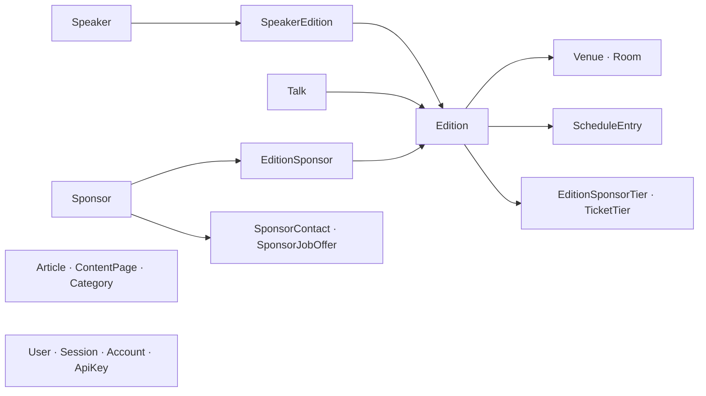

# Database

## Setup

- PostgreSQL, Prisma avec l'adaptateur `pg`. Schéma : `src/backend/prisma/schema.prisma`, client généré dans `src/backend/src/generated/prisma/`
- Seul le backend accède à la base

## Main entities

- `Speaker` et `Sponsor` sont des identités partagées entre éditions (slug `@unique` global) ; leurs participations (`SpeakerEdition`, `EditionSponsor`) portent ce qui est propre à une année
- `EditionSponsor` fige l'apparence affichée cette année-là (`logoUrl`, `tierNameFr/En`, `tierColor`, `tierLogoScale` ; `null` = pas encore figé, relire la valeur vivante). Tout code qui crée une participation doit figer, sinon renommer le catalogue repeint les éditions passées (#375), et un écran qui édite « le logo » doit dire de quelle année il parle. `key` et `rank` du niveau ne sont **jamais** figés : ils pilotent le regroupement et l'ordre
- Les données historiques 2016-2025 viennent de `src/backend/prisma/devfest-history.json` (`import-history.ts`, lancé à la main) — schéma dans `docs/modele-donnees-historique.md`

## Conventions

- Migrations **écrites à la main** dans `src/backend/prisma/migrations/` : `prisma migrate dev` est interactif et inutilisable ici
- Le conteneur backend applique `prisma migrate deploy` puis son seed à chaque démarrage (`scripts/db-boot.sh`) : `seed.ts` en beta/prod, `seed-dev.ts` sur `dev-j` (démo et comptes de dev — c'est aussi celui de la CI)
- `prisma generate` exige un `DATABASE_URL`, même factice : la config le résout sans se connecter
- Suppression douce via `deletedAt` et le filtre `notDeleted`, rétention 30 j (`TRASH_RETENTION_DAYS`). La purge (`POST /api/maintenance/purge-trash`, en-tête `X-Purge-Secret`) n'est appelée par **aucune** tâche planifiée : la corbeille ne se vide pas seule — procédure dans `docs/variables-environnement.md`
- Un `upsert` doit viser un vrai `@id` / `@unique` / `@@unique`, sinon chaque seed ajoute des doublons. Poser l'unicité après coup : dédoublonner dans la migration **avant** de créer l'index, sinon `migrate deploy` échoue
- Supprimer une colonne : chercher ses usages dans tout le dépôt, **seeds compris**. Un seed qui cite une colonne disparue met le backend de `dev-j` en boucle de redémarrage

Modèle métier détaillé : `docs/modele-donnees-metier.md`.
