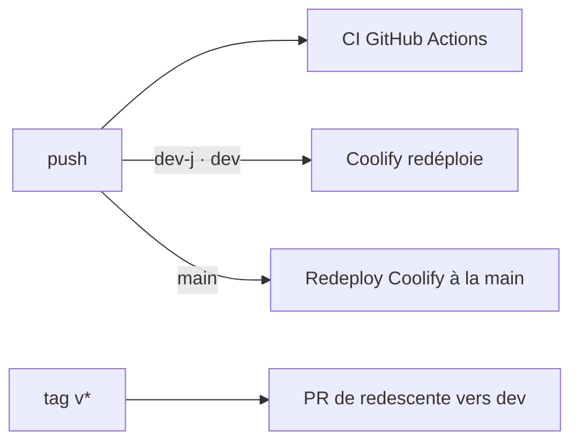

# Deployment

## Pipeline

- GitHub Actions pour la vérification (`.github/workflows/`), Coolify pour le déploiement, sur un VPS OVH
- CI sur push `main`, `dev`, `dev-*` et sur PR vers `main` / `dev` : garde-fou de version, lint + tests + build frontend, typecheck + migrations + seed + tests backend
- Lighthouse CI sur PR vers `main` / `dev`
- Coolify redéploie **automatiquement** sur push `dev-j` et `dev` ; **jamais** sur push `main`

## Environments

| Branche | Environnement | Déploiement | Compose |
| --- | --- | --- | --- |
| `main` | Production — `devfesttoulouse.fr` | manuel | `docker-compose.prod.yml` |
| `dev` | **Beta** — `beta.site.devfesttoulouse.fr` | auto, ~5 min, vérifier `/api/health` | `docker-compose.prod.yml` |
| `dev-j` | Dev perso — `dev-j.site.devfesttoulouse.fr` | auto | `docker-compose.dev.yml` |
| — | Local | — | `docker-compose.local.yml` |

- Piège de nommage : la branche `dev` déploie la **beta**, pas un environnement de dev
- Les deux compose Coolify construisent la même image (build + start). Seuls changent le seed (`seed.ts` minimal contre `seed-dev.ts` avec comptes de test), le SMTP (Postfix réel contre MailHog, où les e-mails restent piégés) et `NODE_ENV`
- Tous les environnements partagent le VPS : `ENV_NAME` donne à chaque backend un alias réseau unique, sans lequel un frontend peut joindre le backend d'un autre environnement — `docs/deployer-nouvel-environnement.md`
- En local, toujours passer `-f` : il n'y a pas de `docker-compose.yml`
- Anciens sites 2016-2025 : hébergement mutualisé OVH, **non renouvelé à l'échéance du 2027-03-01**

## Release

- Promotion `dev` → `main` par PR squashée qui porte le bump SemVer, le CHANGELOG et les `Closes #` ; puis tag `vX.Y.Z` identique à `APP_VERSION` et release GitHub
- Le tag déclenche `version-backport.yml`, qui ouvre la PR de redescente vers `dev`. Ouverte par `GITHUB_TOKEN`, elle ne déclenche **aucune** CI : « no checks » veut dire absence, pas échec
- Les données ne migrent jamais de la beta vers la prod par défaut : c'est un écrasement complet, à la demande seulement
- Procédure complète et retour arrière : `docs/mise-en-production.md`, skill `deploy-to-prod`. Pièges Coolify : `docs/coolify-pieges-multi-environnements.md`

## Monitoring

- Santé : `/api/health` (version déployée ; `dev-j` n'expose pas le commit, `APP_COMMIT` y est vide)
- Déploiements : le MCP Coolify intégré (`https://infra.devfesttoulouse.fr/mcp`, lecture seule) donne l'état et le commit de chaque déploiement. Les trois applications portent presque le même nom : les distinguer par `git_branch` (`main`, `dev`, `dev-j`). Pendant un redéploiement, l'environnement répond « no available server » : c'est la bascule du compose, pas une panne
- Limites du MCP Coolify : `get_logs` d'une application compose ne renvoie que le conteneur frontend ; les logs backend (migrations, seed, erreurs) passent par SSH, `sudo docker logs --tail 200 $(sudo docker ps --format '{{.Names}}' | grep '^backend-<uuid-app>')`. `running:unknown` sur `dev-j` veut dire healthcheck désactivé dans Coolify, pas une panne
- Erreurs 5xx : webhook d'alerte (#118), cf. `integration.md`
- Audience : Plausible. Performance et indexation : Google Search Console et PageSpeed Insights
