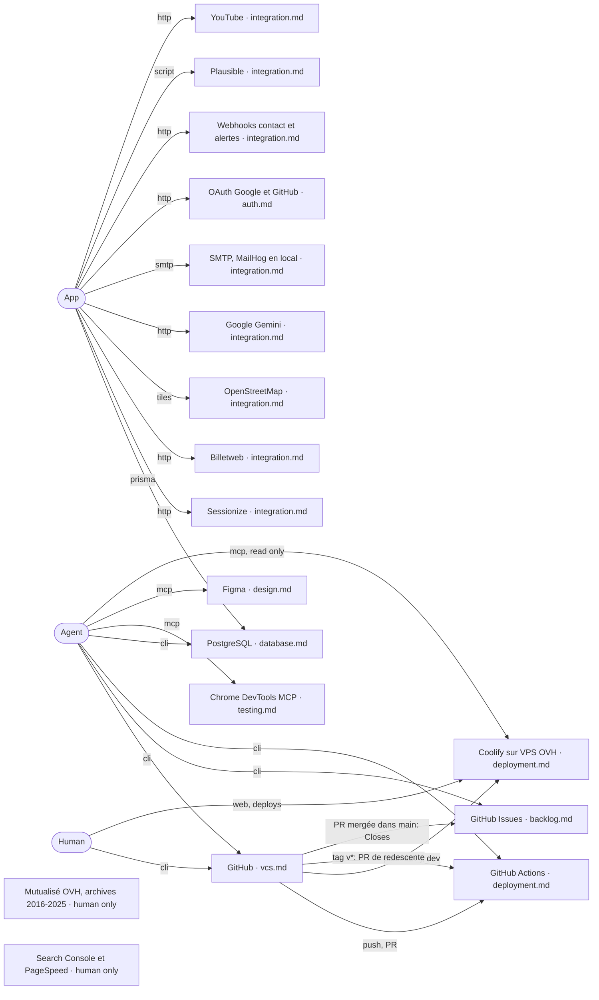

# Ecosystem

```mermaid
flowchart LR
  Human([Human])
  Agent([Agent])
  App([App])
  GitHub["GitHub · vcs.md"]
  Issues["GitHub Issues · backlog.md"]
  Actions["GitHub Actions · deployment.md"]
  Coolify["Coolify sur VPS OVH · deployment.md"]
  OVH["Mutualisé OVH, archives 2016-2025 · human only"]
  Postgres["PostgreSQL · database.md"]
  Sessionize["Sessionize · integration.md"]
  Billetweb["Billetweb · integration.md"]
  OSM["OpenStreetMap · integration.md"]
  Gemini["Google Gemini · integration.md"]
  SMTP["SMTP, MailHog en local · integration.md"]
  OAuth["OAuth Google et GitHub · auth.md"]
  Webhook["Webhooks contact et alertes · integration.md"]
  Plausible["Plausible · integration.md"]
  YouTube["YouTube · integration.md"]
  Figma["Figma · design.md"]
  Search["Search Console et PageSpeed · human only"]
  DevTools["Chrome DevTools MCP · testing.md"]

  Agent -- cli --> GitHub
  Agent -- cli --> Issues
  Agent -- cli --> Actions
  Agent -- cli --> Postgres
  Agent -- mcp --> DevTools
  Agent -- mcp --> Figma
  Human -- cli --> GitHub
  Agent -- "mcp, read only" --> Coolify
  Human -- "web, deploys" --> Coolify
  App -- prisma --> Postgres
  App -- http --> Sessionize
  App -- http --> Billetweb
  App -- tiles --> OSM
  App -- http --> Gemini
  App -- smtp --> SMTP
  App -- http --> OAuth
  App -- http --> Webhook
  App -- script --> Plausible
  App -- http --> YouTube

  GitHub -- "push, PR" --> Actions
  GitHub -- "push dev-j, dev" --> Coolify
  GitHub -- "tag v*: PR de redescente" --> Actions
  GitHub -- "PR mergée dans main: Closes" --> Issues
```
