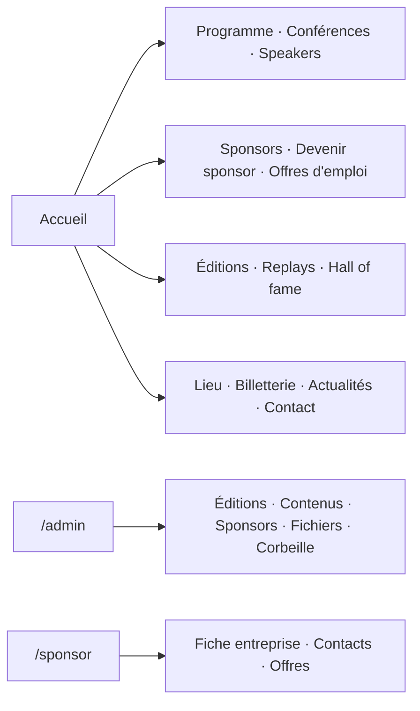

# Navigation

## Routing

- App Router Next.js ; les pages publiques vivent sous `src/frontend/src/app/[locale]/`, avec des URLs localisées FR (défaut) / EN par next-intl
- Hors locale : back-office `/admin`, espace partenaire `/sponsor`, lien speaker `/edit/<token>`. `/fr/admin` renvoie 404
- next-intl préfixe les routes racine **même sans `middleware.ts`** : toute route technique (sonde, webhook, callback) vit sous `/api/`. Vérifier empiriquement (`wget -S` : un `307` vers `/fr/...` trahit le préfixe). Une sonde Docker cassée rend le conteneur `unhealthy` et bloque tous les déploiements (#192)
- Noms voisins, rôles opposés : `/api/health` est réécrit vers le backend (`next.config.ts`), `/api/healthz` est la sonde du frontend lui-même
- Protection : le back-office et l'espace partenaire vérifient la session côté client puis côté API ; l'autorisation qui fait foi est celle du backend

## Structure

