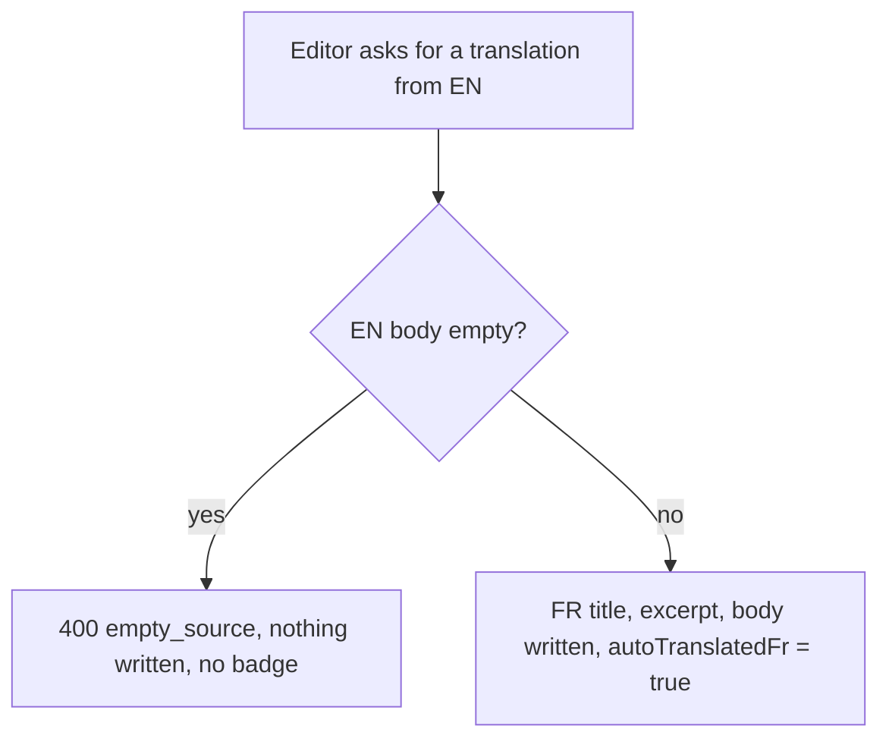
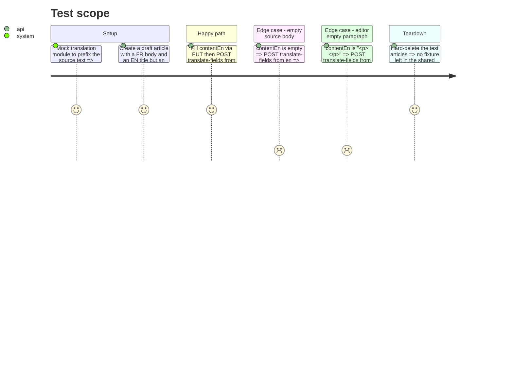

<!-- Fill or omit these sections; never add, rename, or reorder one. -->

# Instruction: Backend — no translation from an empty source

## Architecture projection

> Tree of the final files. ✅ create · ✏️ modify · ❌ delete

```txt
src/backend/src/
├── routes/admin/articles.ts                         ✏️ translate-fields refuses an empty source body
└── __tests__/admin-articles-translate.test.ts       ✅ integration tests, translation module mocked
```

## User Journey



## Test Scope



## Tasks to do

### `1)` Refuse an empty source

> Nothing is written and no badge raised when the source body is empty.

1. In `translate-fields` ([articles.ts:300-311](../../../../src/backend/src/routes/admin/articles.ts#L300-L311)), once the source body is known and before any `translate` call, treat it as empty when it has no text once tags are stripped and trimmed (TipTap saves an empty editor as `<p></p>`).
2. Return `400 { error: "empty_source", message: "Le contenu <FR|EN> est vide : rien à traduire." }`.
3. Update the route comment: the flag means "the body was machine-written" (#488).

### `2)` Integration tests

> Each case has a test that fails without the fix.

1. New file next to `admin-articles.test.ts`, same `buildAdminApp` and `afterAll` hard-delete pattern.
2. `vi.mock("../lib/translation/index.js", …)`: keep the real `TranslationError` and `sendTranslationError` via `vi.importActual`, stub `isConfigured` to `true` and `translate` to return `{ translatedContent: "[auto] " + content }`.
3. Assert the **stored** values through `GET /api/admin/articles/:id`, not the response of the write.
4. Revert the fix, watch the empty-source tests go red, restore.

## Test acceptance criteria

| Task | Acceptance criteria |
| ---- | ------------------- |
| 1 | `translate-fields` from a language whose body is empty or `<p></p>` answers 400 `empty_source` with a French message |
| 1 | After that refusal, the target's title, body and badge are exactly as before |
| 1 | A translation from a non-empty body still writes the target and raises its badge |
| 2 | The new tests pass in the backend container and the empty-source ones fail without the fix; `pnpm typecheck` is green |
