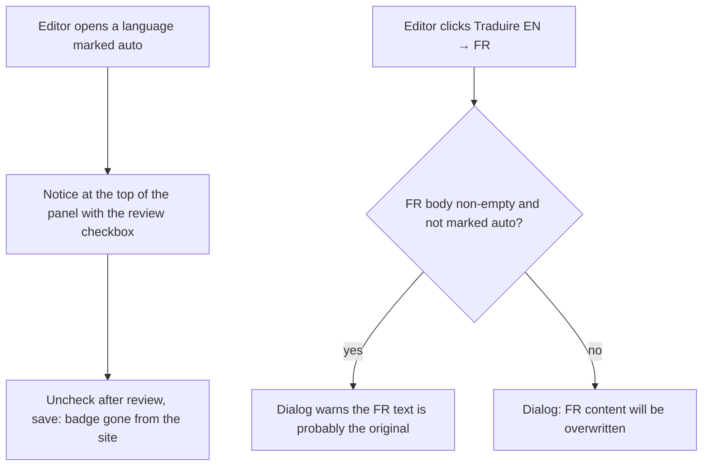
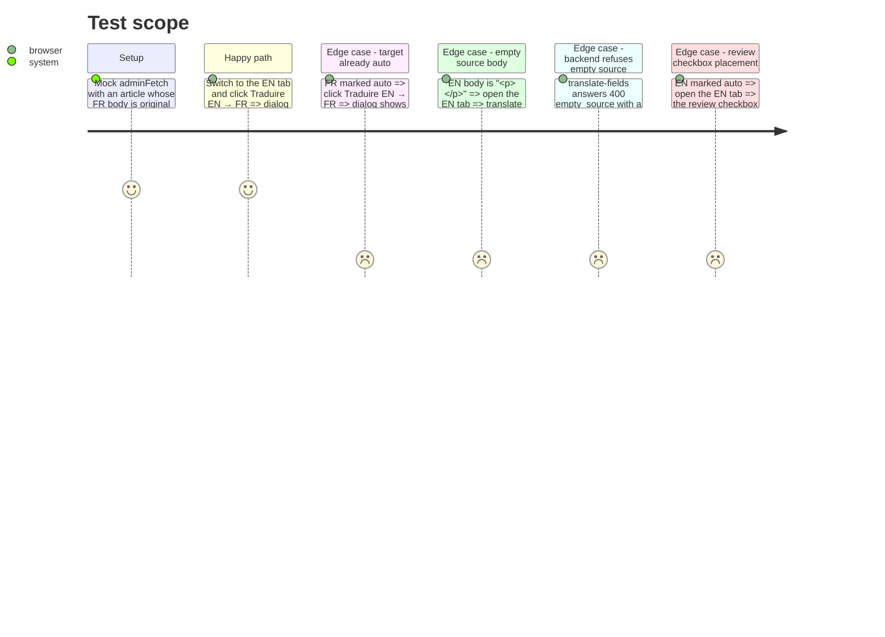

<!-- Fill or omit these sections; never add, rename, or reorder one. -->

# Instruction: Admin editor — overwrite warning, visible review checkbox

## Architecture projection

> Tree of the final files. ✅ create · ✏️ modify · ❌ delete

```txt
src/frontend/src/app/admin/articles/[id]/
├── page.tsx       ✏️ warning in the confirmation, empty source blocked, review checkbox at the top of the panel
└── page.test.tsx  ✅ Testing Library tests, adminFetch mocked
```

## User Journey



## Test Scope



## Wireframe

```txt
┌─ Article ──────────────────────────────────────────────┐
│ [ Français ] [ English · auto ]      [Traduire EN → FR]│
│┌──────────────────────────────────────────────────────┐│
││ [1] ☑ Traduit par IA, pas encore relu.               ││
││     Décochez après relecture pour retirer le bandeau.││
│└──────────────────────────────────────────────────────┘│
│ [2] Title   [______________________________]           │
│     Excerpt [______________________________]           │
│     Content [                              ]           │
└────────────────────────────────────────────────────────┘

┌─ Traduire automatiquement ? ───────────────────────────┐
│ [3] Le contenu FR actuel sera écrasé par la traduction │
│     de l'EN.                                           │
│ [4] Le texte FR n'a pas été traduit automatiquement :  │
│     c'est probablement le texte d'origine.             │
│                                   Annuler  [Traduire]  │
└────────────────────────────────────────────────────────┘
```

1. Review notice with the existing checkbox, first thing in the panel, only when that language is marked auto.
2. Existing fields, unchanged.
3. Existing overwrite sentence.
4. Extra warning, only when the target body is non-empty and not marked auto.

## Tasks to do

### `1)` Make the review checkbox visible

> The editor sees the review checkbox as soon as a language is marked auto.

1. Move each language's checkbox ([page.tsx:355-365](../../../../src/frontend/src/app/admin/articles/[id]/page.tsx#L355-L365), [page.tsx:378-388](../../../../src/frontend/src/app/admin/articles/[id]/page.tsx#L378-L388)) to the top of its panel, framed as a notice with the design tokens used by other admin notices.
2. Say what it does in plain words: machine-translated, not reviewed yet, uncheck after review to remove the banner from the site. French for both panels, as everywhere else in the back-office.
3. Delete the « Astuce » paragraph ([page.tsx:340-344](../../../../src/frontend/src/app/admin/articles/[id]/page.tsx#L340-L344)): the notice replaces it.

### `2)` Warn before overwriting an original text

> The confirmation says when the target holds text the AI did not write.

1. Build the dialog message from `translateFrom`, the target body and the target flag; append the warning sentence when the target body is non-empty and not marked auto.
2. Keep `ConfirmDialog`'s `message: string` prop as is.

### `3)` Block an empty source

> The translate button cannot be used when the active language has no body.

1. Extend the button's `disabled` condition ([page.tsx:320](../../../../src/frontend/src/app/admin/articles/[id]/page.tsx#L320)) to an empty source body, with the backend's emptiness rule; parenthesise the existing `||`/`&&` mix.
2. In `runTranslate`, show non-200 failures through `humanError` (`src/frontend/src/lib/admin-api.ts`) so the backend's French `message` wins over the `empty_source` code.

### `4)` Tests

> Each behaviour has a test that fails without it.

1. Follow `src/frontend/src/app/admin/sponsors/[id]/page.test.tsx`: mock `next/navigation`, `@/lib/admin-api` and `RichTextEditor`.
2. One `it` per section of the test scope.

### `5)` Browser check

> The journey is seen working locally.

1. Local stack, `/admin`, an article with a FR body and an empty EN body: the EN tab's translate button is disabled.
2. Fill the EN body, translate FR → EN: the EN panel opens with the review notice on top. Click Traduire EN → FR: the dialog warns about the original FR text; cancel.
3. Uncheck the notice, save, open `/en/actualites/<slug>`: no banner. Console clean.

## Test acceptance criteria

| Task | Acceptance criteria |
| ---- | ------------------- |
| 1 | On a language marked auto, the review checkbox is the first element of the panel, with a sentence saying unchecking removes the banner from the site |
| 1 | Unchecking it and saving removes the banner from that language's public page |
| 2 | Asking for EN → FR over an original FR text shows a warning that the FR text was not machine-translated |
| 2 | Asking for EN → FR over a FR text marked auto shows only the overwrite sentence |
| 3 | The translate button is disabled when the active language's body is empty |
| 3 | A 400 `empty_source` shows the backend's French message, which does not fade on its own |
| 4 | The new tests pass, `pnpm lint` is clean, `pnpm build` passes |
