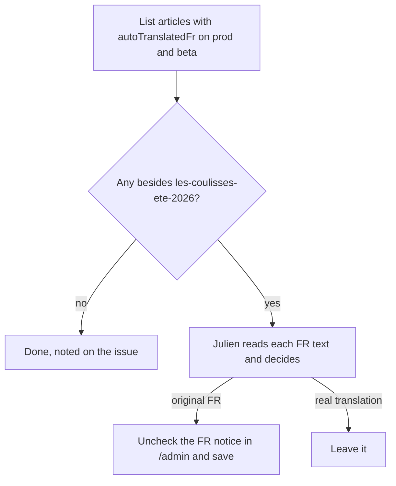
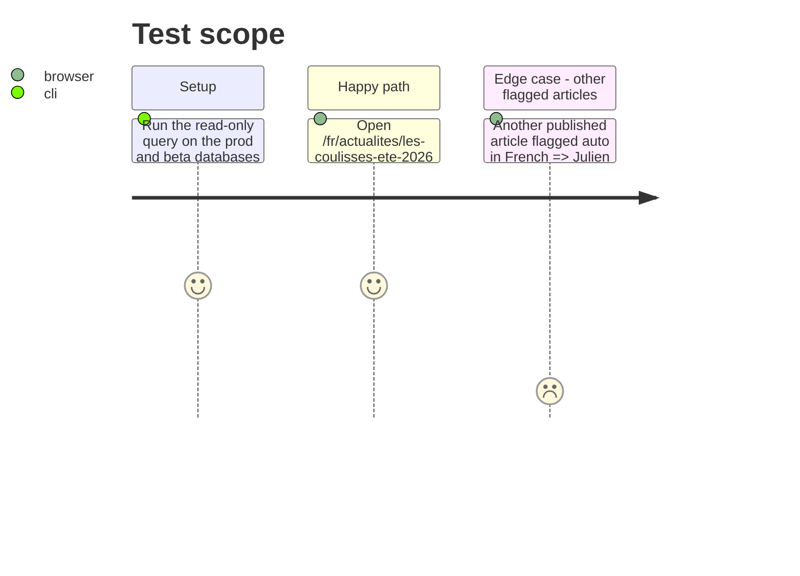

<!-- Fill or omit these sections; never add, rename, or reorder one. -->

# Instruction: Data — other articles flagged auto in French

## Architecture projection

> Tree of the final files. ✅ create · ✏️ modify · ❌ delete

```txt
.
```

No file changes. `les-coulisses-ete-2026` is already fixed (Julien unchecked the FR box on 2026-09-28; the FR page shows no banner, the EN page keeps it). What remains is checking no other article carries the same wrong badge. Every write on a live environment is confirmed with Julien first.

## User Journey



## Test Scope



## Tasks to do

### `1)` Inventory

> Know every article whose FR is flagged, on each environment.

1. `/api/articles` is not proxied by the public site (it answers the Next 404), so read the database: `select slug, "publicationStatus", "translatedAtFr" from "Article" where "autoTranslatedFr" and "deletedAt" is null;` on prod and beta, read only. Find the database containers as described in the auto memory (`project_vps_container_identification.md`).
2. Report the list to Julien, and to the issue as a comment.

### `2)` Correction

> Only the articles Julien confirms lose the FR badge.

1. For each confirmed article: `/admin/articles/<id>`, FR tab, uncheck the notice, save. Keep the EN badge.
2. Reload `/fr/actualites/<slug>` and `/en/actualites/<slug>`.

## Test acceptance criteria

| Task | Acceptance criteria |
| ---- | ------------------- |
| 1 | Julien and the issue have the list of articles flagged auto in French on prod and beta |
| 2 | `/fr/actualites/les-coulisses-ete-2026` shows no banner, `/en/actualites/les-coulisses-ete-2026` still does |
| 2 | Every article Julien confirmed as original French shows no banner in French |
