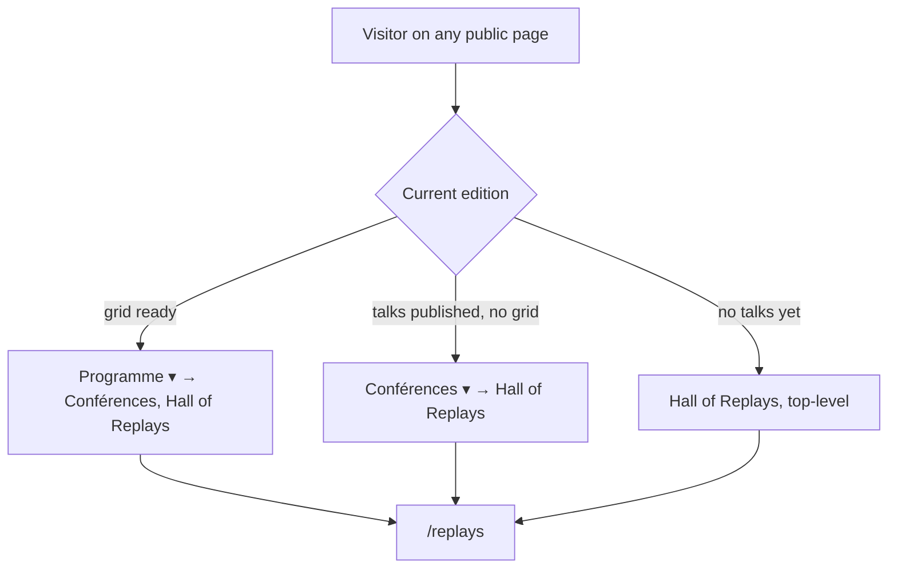
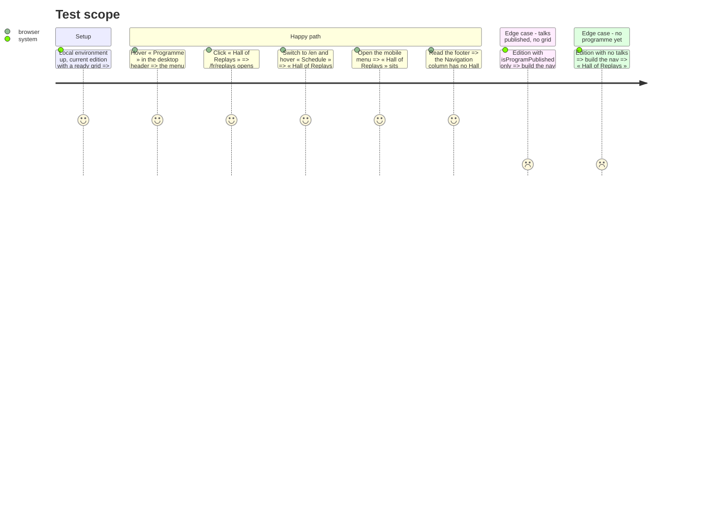

# Instruction: Hall of Replays in the nav

## Architecture projection

> Tree of the final files. ✅ create · ✏️ modify · ❌ delete

```txt
src/frontend/
├── messages/
│   ├── en.json                 ✏️ nav.replays = "Hall of Replays"
│   └── fr.json                 ✏️ nav.replays = "Hall of Replays"
└── src/
    ├── components/
    │   └── Footer.tsx          ✏️ filter "replays" out of the Navigation column, as "hall-of-fame" already is
    └── lib/
        ├── nav.ts              ✏️ REPLAYS_ENTRY, placed according to the edition's state
        └── nav.test.ts         ✏️ lock the placement in the three states, and its single occurrence
```

`Header.tsx` is unchanged: it already renders one level of children, on desktop and in the mobile menu.

## User Journey



## Test Scope



## Wireframe

```txt
┌──────────────────────────────────────────────────────────────────────┐
│ (1) État A — programme publié, grille pas prête (la prod aujourd'hui)│
│ [logo]  Conférences ▾   Speakers ▾   Sponsors ▾   Actus      [FR/EN] │
│         ┌──────────────────┐                                         │
│         │ (2) Hall of Replays                                        │
│         └──────────────────┘                                         │
├──────────────────────────────────────────────────────────────────────┤
│ (3) État B — grille prête                                            │
│ [logo]  Programme ▾   Speakers ▾   Sponsors ▾   Actus        [FR/EN] │
│         ┌──────────────────┐                                         │
│         │ Conférences      │                                         │
│         │ (4) Hall of Replays                                        │
│         └──────────────────┘                                         │
├──────────────────────────────────────────────────────────────────────┤
│ (5) État C — pas de programme (édition en préparation)               │
│ [logo]  Hall of Replays   Speakers ▾   Actus                 [FR/EN] │
└──────────────────────────────────────────────────────────────────────┘

┌──────────────────────┬──────────────────────────┐
│ (6) Navigation       │ (7) Éditions précédentes │
│  Conférences         │  DevFest Toulouse 2025   │
│  Speakers            │  …                       │
│  Sponsors            │  Replays                 │
│  Actus               │  Hall of fame            │
└──────────────────────┴──────────────────────────┘
```

1. État A : « Conférences » becomes a dropdown; its parent link still leads to `/conferences`.
2. The submenu lists only the replays, no duplicate of the parent — the Sponsors → job offers pattern.
3. État B : « Programme » carries two children.
4. Replays come after « Conférences »: the current edition first, the archives next.
5. État C : top-level entry, where the programme would be.
6. The Navigation column does not repeat Hall of Replays: filtered like the hall of fame (#369).
7. Unchanged: « Replays » keeps its footer label.

## Tasks to do

### `1)` Write the failing tests

> Lock the placement before touching `nav.ts`, and watch them go red.

1. In `nav.test.ts`, assert: flat « Conférences » carries `children` `["replays"]`; « Programme » carries `["conferences", "replays"]`; with no talks, `replays` is a top-level entry placed first.
2. Add one test asserting `replays` appears exactly once across entries and their children, in each of the three states.
3. Update the existing exact-list expectations that now gain `replays` first when there is no programme (`blog`-only, `null` edition, Speakers-only, venue-only, and the three content-page tests with a bare edition), and the flat-Conférences test that asserted `children` undefined.
4. Run `cd src/frontend && pnpm exec vitest run src/lib/nav.test.ts`: the new assertions fail.

### `2)` Place the replays in the nav

> One entry, three placements, one comment that says why.

1. In `nav.ts`, add `REPLAYS_ENTRY` (`key: "replays"`, `labelKey: "replays"`, `href: "/replays"`), with a comment citing #489: it spans every edition, so it never depends on the current one having talks.
2. Grid ready: `children: [CONFERENCES_ENTRY, REPLAYS_ENTRY]`. Talks only: `{ ...CONFERENCES_ENTRY, children: [REPLAYS_ENTRY] }`. Otherwise: push `REPLAYS_ENTRY` top-level, where the programme would be.
3. Update the comment above `getPublicNavEntries` that says only « Programme » carries children.

### `3)` Label in both locales

> The key lives under `nav`, not `footer` — the #369 trap.

1. Add `"replays": "Hall of Replays"` under `nav` in `messages/fr.json` and `messages/en.json`.
2. The existing « every entry and child has a label » test now covers it: it builds an edition with a ready grid, which carries the replays child.

### `4)` Keep the footer free of duplicates

> The Navigation column flattens the menu; the archives column already links the replays.

1. In `Footer.tsx`, filter `replays` out alongside `hall-of-fame`, and extend the comment to name #489.

### `5)` Verify

> Nothing ships unseen.

1. Run the assertions in `aidd_docs/memory/coding-assertions.md` (frontend lint, tests, build).
2. Restart `devfest-local-frontend` (no hot reload), then walk the Test Scope happy path in the browser, desktop and mobile, FR and EN; check the console is clean.

## Test acceptance criteria

| Task | Acceptance criteria |
| ---- | ------------------- |
| 1 | The new placement tests fail against the current `nav.ts` |
| 2 | With a ready grid, « Programme » lists « Conférences » then « Hall of Replays »; with talks only, « Conférences » lists « Hall of Replays »; with no talks, « Hall of Replays » is the first top-level entry |
| 2 | « Hall of Replays » appears exactly once in the menu, whatever the edition's state |
| 3 | « Hall of Replays » reads the same on `/fr` and `/en`; no raw `nav.replays` anywhere |
| 4 | The footer's Navigation column has no Hall of Replays; the archives column still shows « Replays » once |
| 5 | Lint, frontend tests and build pass; the link opens `/replays` from the desktop dropdown and the mobile menu, console clean |
