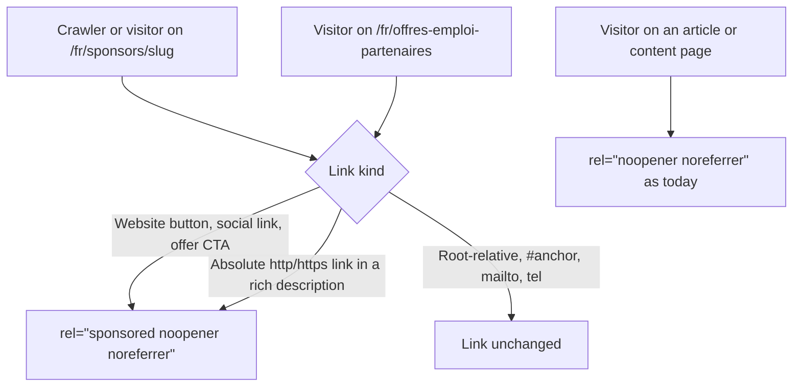
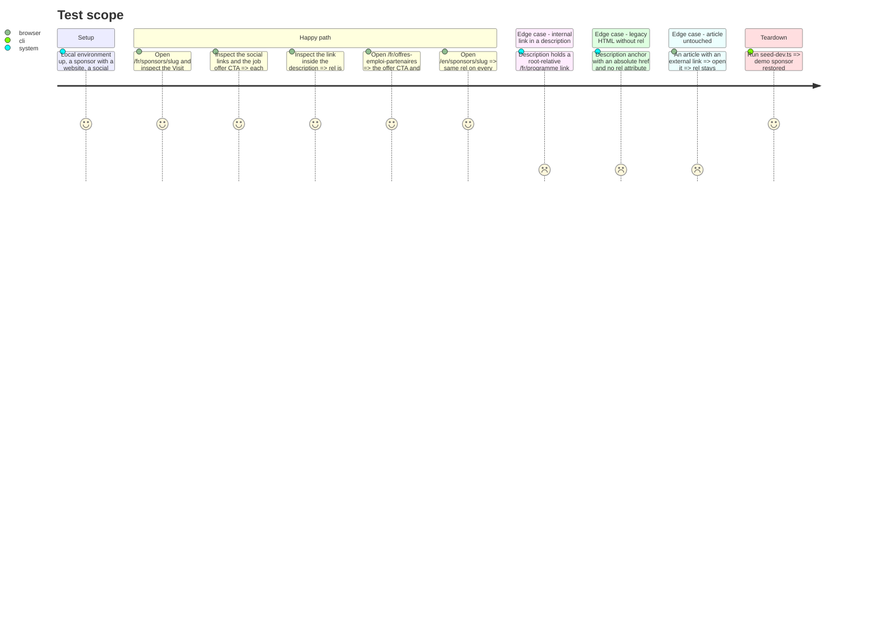

# Instruction: Sponsored rel on every partner link

## Architecture projection

> Tree of the final files. ✅ create · ✏️ modify · ❌ delete

```txt
src/frontend/src/
├── lib/
│   ├── html.ts                                   ✏️ SPONSORED_LINK_REL + markLinksSponsored(html)
│   └── html.test.ts                              ✏️ lock which links gain `sponsored` and which do not
└── app/[locale]/
    ├── sponsors/[slug]/page.tsx                  ✏️ website button, social links, offer CTA → SPONSORED_LINK_REL; description and offer descriptions → markLinksSponsored
    └── offres-emploi-partenaires/page.tsx        ✏️ offer CTA → SPONSORED_LINK_REL; offer description → markLinksSponsored
```

The backend is unchanged: `sanitizeRichHtml` keeps forcing `noopener noreferrer`, which is right for articles and pages. The public API keeps returning the stored HTML.

## User Journey



## Test Scope



## Tasks to do

### `1)` Write the failing tests

> Lock the rewrite before writing it, and watch it go red.

1. In `html.test.ts`, describe `markLinksSponsored`: an `<a href="https://…" rel="noopener noreferrer">` becomes `rel="sponsored noopener noreferrer"`; an `http://` link too; an anchor with no `rel` gains it; `href`, `target`, the text and the surrounding HTML are unchanged.
2. Assert what stays untouched: root-relative `/…`, `#…`, `mailto:` and `tel:` links; plain text; an empty string.
3. Assert idempotence: running it twice yields no duplicated `sponsored`.
4. Run `cd src/frontend && pnpm exec vitest run src/lib/html.test.ts`: the new tests fail.

### `2)` Write the helper

> One constant, one function, one comment that says why it lives here and not in the sanitizer.

1. In `html.ts`, export `SPONSORED_LINK_REL = "sponsored noopener noreferrer"`.
2. Export `markLinksSponsored(html)`: for each `<a …>` opening tag whose `href` starts with `http://` or `https://`, drop any existing `rel` and set `rel` to `SPONSORED_LINK_REL`. The input is server-sanitized HTML (double-quoted attributes), so a tag-level regex is enough — no parser dependency.
3. Comment: Google asks paid links to be qualified (#495); done at render because `sanitizeRichHtml` is shared with articles and rewrites `rel` on every save.

### `3)` Apply it to the sponsor fiche

> Every partner link on `sponsors/[slug]/page.tsx`.

1. Website button, social links and job offer CTA: `rel={SPONSORED_LINK_REL}`.
2. Sponsor description (HTML branch) and job offer descriptions: pass through `markLinksSponsored` before `dangerouslySetInnerHTML`.

### `4)` Apply it to the partner job offers page

> Same offers, other page: `offres-emploi-partenaires/page.tsx`.

1. Offer CTA: `rel={SPONSORED_LINK_REL}`.
2. Offer description: `markLinksSponsored`.

### `5)` Verify

> Nothing ships unseen.

1. Run the assertions in `aidd_docs/memory/coding-assertions.md` (frontend lint, tests, build).
2. Restart `devfest-local-frontend` (no hot reload), set up the sponsor from the Test Scope through `/admin`, walk the happy path in FR and EN, check an article, and read the rendered `rel` with `evaluate_script`, not by eye. Console clean.

## Test acceptance criteria

| Task | Acceptance criteria |
| ---- | ------------------- |
| 1 | The new `markLinksSponsored` tests fail before the helper exists |
| 2 | Absolute http/https links gain `rel="sponsored noopener noreferrer"`, with or without a prior `rel`; internal, anchor, mailto and tel links and plain text come out identical; a second pass changes nothing |
| 3 | On a sponsor fiche, the website button, every social link, every job offer CTA and every external link in the descriptions carry `sponsored noopener noreferrer` |
| 4 | On the partner job offers page, every offer CTA and external description link carries `sponsored noopener noreferrer` |
| 5 | Lint, frontend tests and build pass; the rel values read in the browser match, in FR and EN; an article's external link still reads `noopener noreferrer` |
