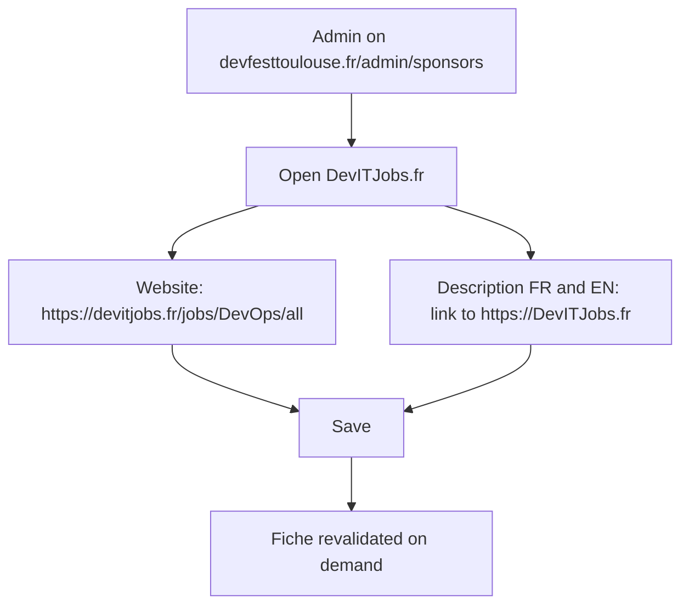
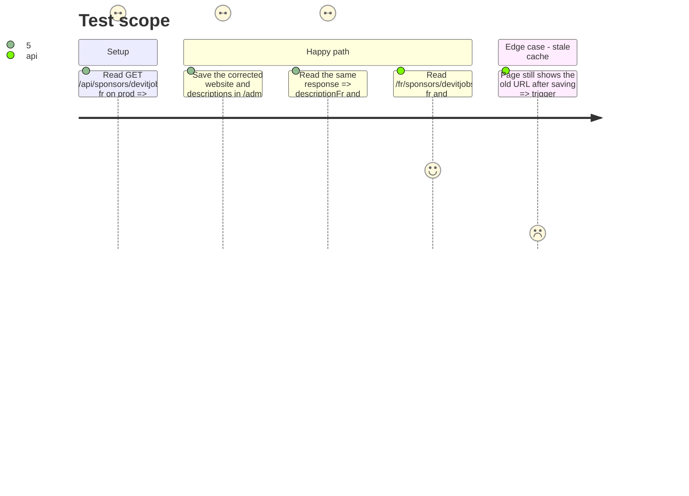

# Instruction: Clean the DevITJobs.fr record in prod

## Architecture projection

> Tree of the final files. ✅ create · ✏️ modify · ❌ delete

```txt
.
```

No file changes: a data correction done by a human through the production back-office. It does not depend on phase 1 and can be done before the release; the `sponsored` on the description link only appears once phase 1 is in production.

## User Journey



## Test Scope



## Tasks to do

### `1)` Correct the website URL

> The rel belongs on the link, not in the query string.

1. In the production back-office, open the DevITJobs.fr sponsor and set the website to `https://devitjobs.fr/jobs/DevOps/all`.

### `2)` Correct the description link

> https, both languages.

1. In the FR and EN descriptions, edit the `DevITJobs.fr` link to `https://DevITJobs.fr`.
2. Save once, and confirm the save feedback shows success.

### `3)` Verify

> Read what production serves, not the form.

1. `curl -s https://devfesttoulouse.fr/api/sponsors/devitjobs-fr` shows the new `websiteUrl` and both https links.
2. The FR and EN fiches serve the new button href. Once phase 1 is released, every link on them also reads `rel="sponsored noopener noreferrer"`.

## Test acceptance criteria

| Task | Acceptance criteria |
| ---- | ------------------- |
| 1 | The prod API returns `websiteUrl` `https://devitjobs.fr/jobs/DevOps/all`, with no `rel` parameter |
| 2 | `descriptionFr` and `descriptionEn` link to `https://DevITJobs.fr`, no `http://` left |
| 3 | The FR and EN fiches serve the corrected button href; after the phase 1 release, their partner links carry `sponsored` |
