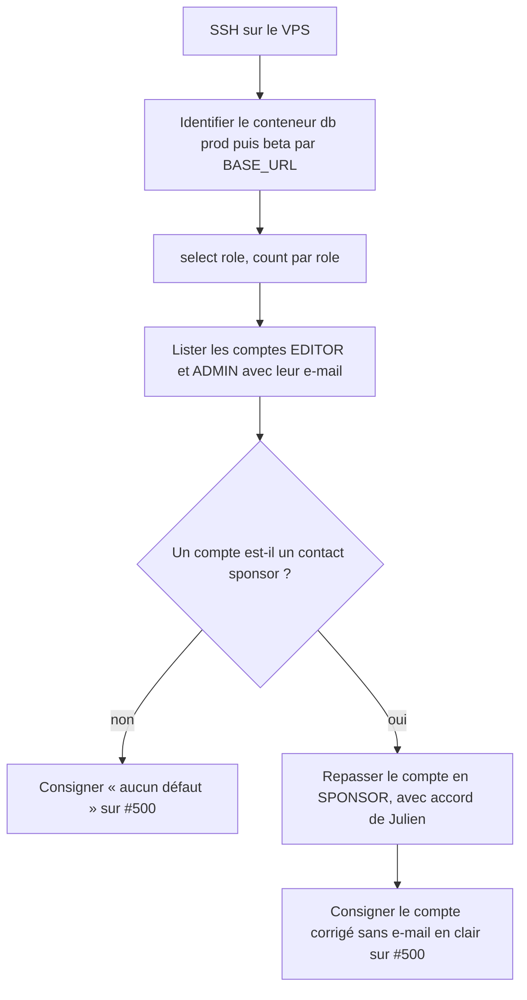
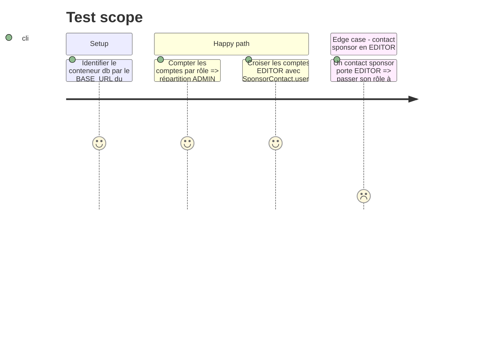

# Instruction: Audit des rôles stockés en prod et en beta (#500, tâche 1)

## Architecture projection

> Tree of the final files. ✅ create · ✏️ modify · ❌ delete

```txt
.
└── (aucun fichier : lecture de la base prod et beta sur le VPS, résultat consigné en commentaire de #500)
```

## User Journey



## Test Scope



## Tasks to do

### `1)` Identifier les bases

> Viser la bonne base : les hashes Coolify changent à chaque redéploiement.

0. Julien exécute toutes les commandes de cette phase ; l'agent ne se connecte jamais au VPS (`CLAUDE.md`), il les prépare et lit les résultats.
1. Détecter le conteneur `backend-*` dont `BASE_URL` vaut `https://devfesttoulouse.fr`, en déduire `db-<hash>` ; idem pour `https://beta.site.devfesttoulouse.fr`.
2. Afficher les deux noms et les relire avant toute requête.

### `2)` Lire les rôles

> Savoir si un compte tiers a le back-office.

1. `select role, count(*) from "user" group by role;` sur chaque base.
2. `select u.email, u.role from "user" u join "SponsorContact" sc on sc."userId" = u.id where u.role <> 'SPONSOR';` (`User` est mappé sur `"user"`, `SponsorContact` n'a pas de `@@map`).
3. Comparer la liste des comptes `ADMIN`/`EDITOR` aux membres de l'équipe et à `ADMIN_EMAILS`.

### `3)` Corriger si besoin

> Fermer l'accès sans attendre le correctif de code.

1. Présenter à Julien chaque compte fautif ; n'écrire qu'après son accord.
2. `update "user" set role = 'SPONSOR' where id = '<id>';`, puis relancer la requête de croisement.

### `4)` Consigner

> Laisser la trace sur l'issue, sans donnée personnelle.

1. Commentaire sur #500 : répartition par rôle par environnement, nombre de comptes corrigés, sans e-mail.

## Test acceptance criteria

| Task | Acceptance criteria |
| ---- | ------------------- |
| 1 | Les deux conteneurs interrogés sont ceux de prod et de beta, identifiés par leur `BASE_URL` |
| 2 | La répartition des rôles de chaque base est connue, et chaque compte `ADMIN`/`EDITOR` est rattaché à un membre de l'équipe |
| 3 | Aucun compte lié à un `SponsorContact` ne porte `ADMIN` ou `EDITOR` |
| 4 | #500 porte un commentaire qui donne le résultat par environnement, sans adresse e-mail |
