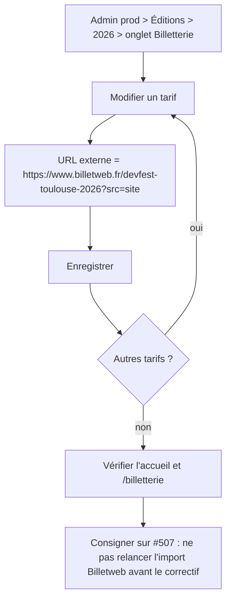
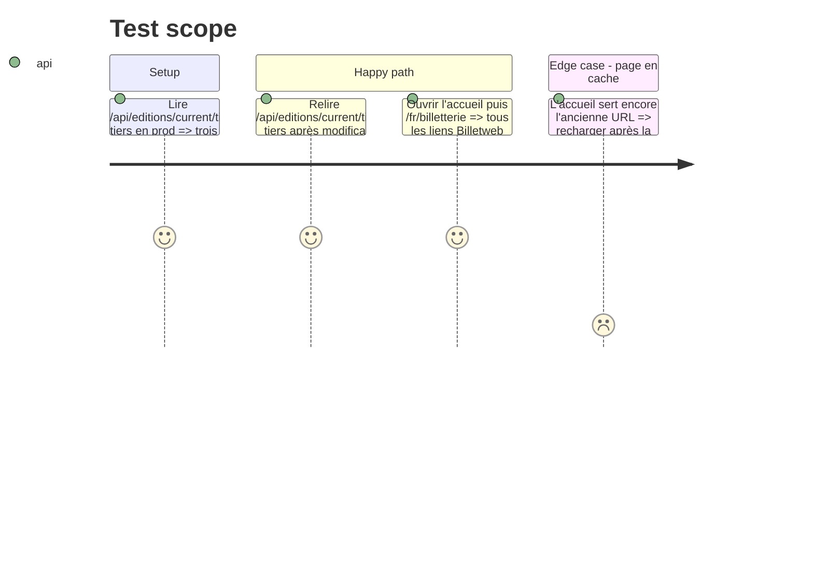

# Instruction: Suivi Billetweb rétabli par les données (#507, contournement)

## Architecture projection

> Tree of the final files. ✅ create · ✏️ modify · ❌ delete

```txt
.
└── (aucun fichier : TicketTier.externalUrl des tarifs 2026 modifié depuis l'admin de prod)
```

## User Journey



## Test Scope



## Tasks to do

### `1)` Vérifier la forme de l'URL suivie

> Ne pas remplacer une URL qui marche par une URL cassée.

1. Ouvrir `https://www.billetweb.fr/devfest-toulouse-2026?src=site` : la boutique de l'événement s'affiche.
2. Confirmer avec Thomas (déclarant) que c'est bien le lien de suivi attendu.

### `2)` Modifier les tarifs

> Toutes les URLs de billetterie du site lisent `TicketTier.externalUrl`.

1. Dans l'admin de prod, onglet Billetterie de l'édition 2026, mettre l'URL suivie sur chaque tarif, y compris les tarifs épuisés (le lien « Voir la billetterie » reprend le premier tarif).
2. Enregistrer chaque tarif.

### `3)` Vérifier et consigner

> Prouver le résultat sur le site public, et protéger la correction.

1. Relire l'API publique des tarifs et le HTML de l'accueil et de `/fr/billetterie`.
2. Commentaire sur #507 : contournement appliqué, **ne pas relancer « Importer depuis Billetweb »** tant que le correctif de l'import n'est pas en prod (il efface et recrée les tarifs).

## Test acceptance criteria

| Task | Acceptance criteria |
| ---- | ------------------- |
| 1 | L'URL suivie ouvre la boutique de l'édition 2026 |
| 2 | Chaque tarif 2026 a pour URL externe l'URL suivie |
| 3 | L'accueil, `/fr/billetterie` et l'API publique ne contiennent plus `shop.php`, et #507 avertit de ne pas réimporter |
