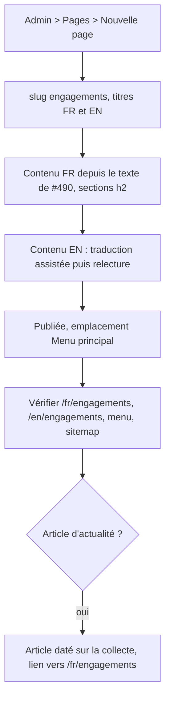
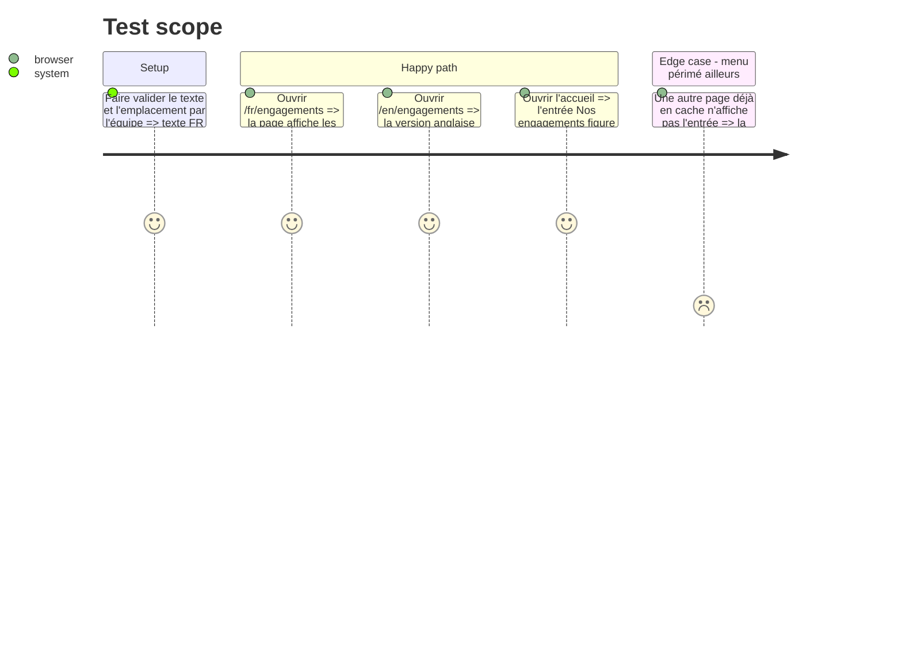

# Instruction: Page « Nos engagements » publiée (#490)

## Architecture projection

> Tree of the final files. ✅ create · ✏️ modify · ❌ delete

```txt
.
└── (aucun fichier : une ContentPage créée depuis l'admin de prod, et un article d'actualité facultatif)
```

## User Journey



## Test Scope



## Tasks to do

### `1)` Faire valider le contenu

> Publier un texte que l'équipe assume.

1. Reprendre le texte de #490 (Montaine), corriger « une une caisse », nommer partout « l'Atelier Numérique d'Emmaüs Agir ».
2. Faire trancher l'emplacement : menu principal (recommandé) ou pied de page, et les sections retenues (Emmaüs, écoconception, accessibilité, Tech Speak'Her).

### `2)` Créer et publier la page

> Tout se fait dans l'admin, sans déploiement.

1. Admin > Pages > « Nouvelle page » : slug `engagements`, « Nos engagements » / « Our commitments ».
2. Contenu FR en sections `h2`, liens vers emmaus-agir-31.fr et vers l'adresse de don de flotte.
3. Contenu EN par la traduction assistée, relu.
4. Cocher « Page publiée », emplacement choisi, enregistrer.

### `3)` Vérifier et clore

> Constater la mise en ligne, puis fermer la boucle avec l'équipe.

1. Vérifier les deux langues, le menu, le pied de page et `/sitemap.xml`.
2. Noter sur #490 si les autres pages affichent le menu tout de suite ou après l'expiration du cache, et proposer la fermeture.
3. Facultatif : article d'actualité « Collecte de matériel informatique le 19 novembre » renvoyant vers la page.

## Test acceptance criteria

| Task | Acceptance criteria |
| ---- | ------------------- |
| 1 | Le texte et l'emplacement ont l'accord de l'équipe |
| 2 | `/fr/engagements` et `/en/engagements` répondent 200 avec le contenu validé |
| 3 | L'entrée apparaît dans la navigation choisie, la page est dans le sitemap, et #490 rapporte le constat sur le cache |
