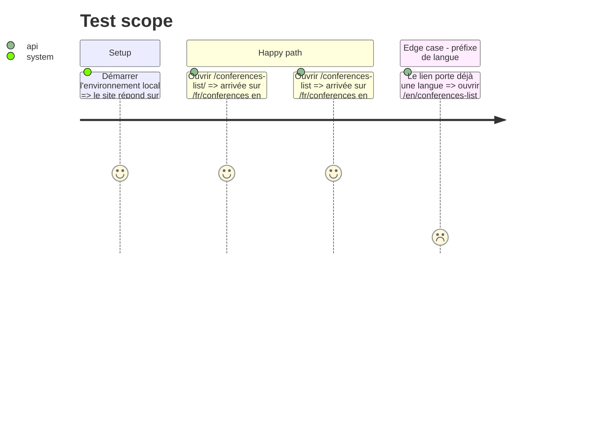

# Instruction: Liens entrants réparés et écosystème contacté (#386)

## Architecture projection

> Tree of the final files. ✅ create · ✏️ modify · ❌ delete

```txt
.
└── src/
    └── frontend/
        └── next.config.ts   ✏️ redirection permanente /conferences-list → /fr/conferences
```

## User Journey

```mermaid
flowchart TD
  A[Visiteur sur la fiche GDG Toulouse] --> B[Clic sur le lien du programme]
  B --> C[/conferences-list/]
  C --> D[308 puis redirection permanente]
  D --> E[/fr/conferences s'affiche]
```

## Test Scope



## Tasks to do

### `1)` Redirection dans le site

> Un lien entrant existant ne doit plus tomber sur une 404, quel que soit l'état de la fiche GDG.

1. Créer `fix/us-386-conferences-list-redirect` depuis `dev-j`.
2. Dans `redirects()` de `next.config.ts`, ajouter `/conferences-list` → `/fr/conferences` et `/:locale(fr|en)/conferences-list` → `/:locale/conferences`, `permanent: true`, sur le modèle de `/partners`.
3. Vérifier en local que la redirection passe avant le préfixage de next-intl (`curl -sIL`), puis lint, build.
4. Commit, puis push et PR vers `dev-j` après accord de Julien.

### `2)` Corrections chez les tiers (hors code)

> Réparer la source des liens, pas seulement leur arrivée.

0. **Abandonné (2026-10-03)** : Julien a décidé de ne rien faire corriger chez les tiers ; #386 fermée en « not planned ». Seule la redirection (tâche 1) part en prod.
1. Fiche GDG Toulouse (`gdg.community.dev`) : lien du programme vers `/fr/conferences` ; lien libellé `devfesttoulouse.fr` qui pointe vers LinkedIn, à corriger.
2. Human Coders : demander la correction de la date (19 novembre, pas octobre).
3. La Mêlée (`contact@lamelee.com`) : proposer le DevFest à l'agenda, pour l'audience.
4. French Tech : consigner la décision d'y aller ou non (aucun bénéfice SEO, iframe Airtable).

### `3)` Consigner

> Garder l'état de chaque démarche sur l'issue.

1. Commentaire sur #386 : redirection livrée (ou en cours), et statut de chaque démarche externe.

## Test acceptance criteria

| Task | Acceptance criteria |
| ---- | ------------------- |
| 1 | `/conferences-list/`, `/conferences-list` et `/en/conferences-list` aboutissent en 200 sur la page Conférences de la bonne langue, en local puis sur `dev-j` |
| 2 | La fiche GDG ne pointe plus vers une URL morte ni vers LinkedIn sous un libellé de site, et chaque démarche externe est faite ou écartée explicitement |
| 3 | #386 donne l'état de chaque tâche |
