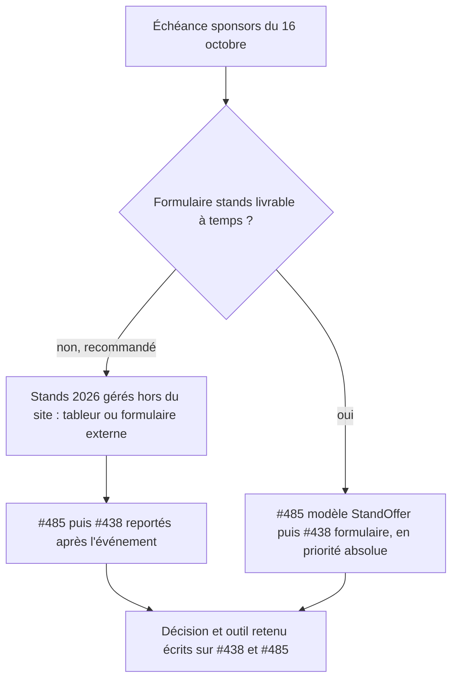

# Instruction: Stands 2026 — décision consignée (#438, #485)

## Architecture projection

> Tree of the final files. ✅ create · ✏️ modify · ❌ delete

```txt
.
└── (aucun fichier : décision écrite sur #438 et #485)
```

## User Journey



## Test Scope

```mermaid
---
title: Test scope
---
journey
  section Setup
    Réunir l'état des issues #438 et #485 et l'échéance du guide sponsors => options et coûts présentés: 5: system
  section Happy path
    Julien et l'équipe sponsors tranchent => une option retenue avec son outil: 5: system
    Écrire la décision sur #438 et #485 => chaque issue dit si elle vise 2026 ou 2027: 5: system
```

## Tasks to do

### `1)` Présenter l'arbitrage

> Décider en connaissant le coût réel.

0. **Tranché (2026-10-03)** : gestion des stands reportée à l'édition 2027 ; stands 2026 suivis hors du site par l'équipe sponsors ; ordre pour 2027 : #485 puis #438. Décision écrite sur les deux issues.
1. Rappeler : #485 invalide le modèle de #438 (catalogue `StandOffer`), #438 est estimé L, l'échéance est le 16 octobre, le montage le 18 novembre.
2. Recommandation : gérer les stands 2026 hors du site (tableur partagé ou formulaire externe), reporter #485 puis #438 après l'événement.

### `2)` Consigner

> Que la décision survive à la conversation.

1. Commentaire sur #438 et #485 : décision, outil retenu pour 2026, ordre pour la suite (#485 avant #438).
2. Si l'équipe sponsors (@kadorito) n'est pas d'accord, rouvrir la discussion avant le 9 octobre.

## Test acceptance criteria

| Task | Acceptance criteria |
| ---- | ------------------- |
| 1 | L'équipe sponsors connaît le coût et l'alternative avant de trancher |
| 2 | #438 et #485 disent chacune, par écrit, si elles visent 2026 ou une édition suivante, et quel outil sert en 2026 |
