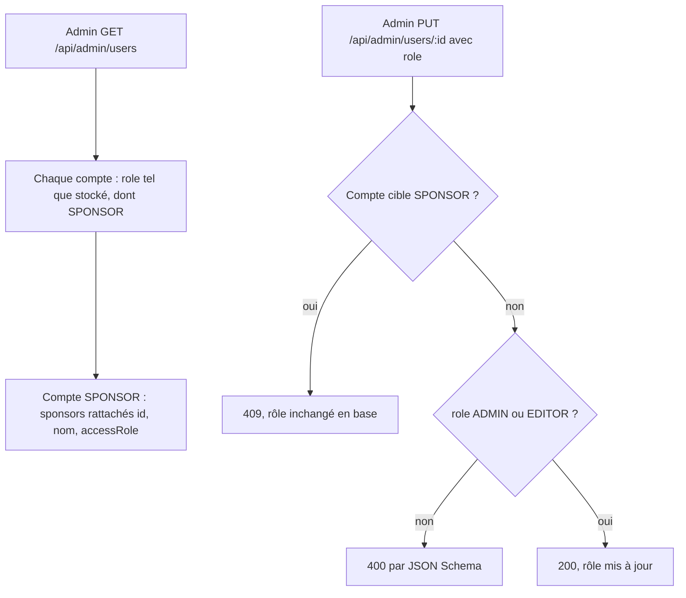
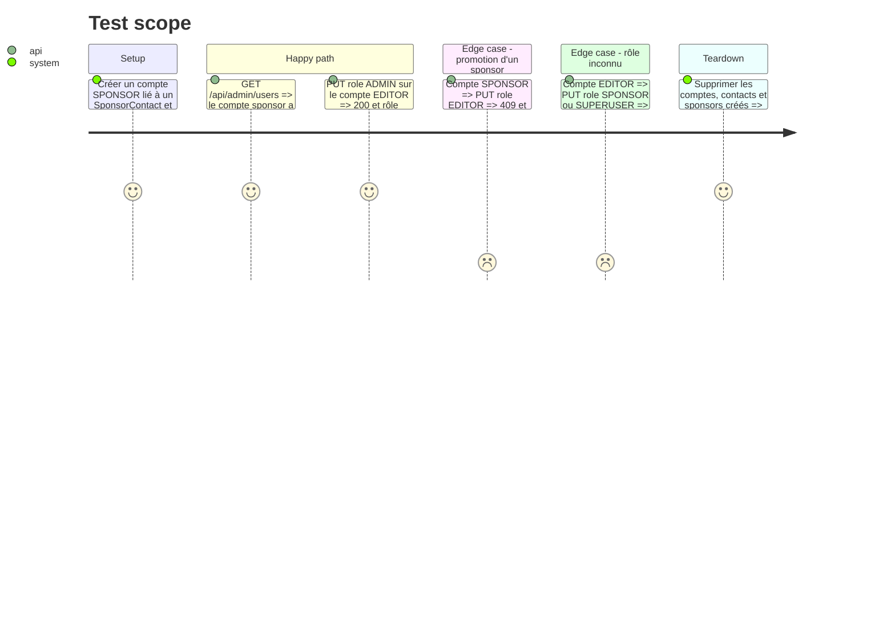

# Instruction: #500 backend — rôles verrouillés et sponsors rattachés

## Architecture projection

> Tree of the final files. ✅ create · ✏️ modify · ❌ delete

```txt
.
└── src/backend/src/
    ├── routes/admin/users.ts                 ✏️ JSON Schema sur POST/PUT, refus de changer le rôle d'un SPONSOR, sponsors rattachés dans GET
    └── __tests__/admin-users.test.ts         ✅ liste, refus de promotion (rôle stocké), validation du rôle
```

## User Journey



## Test Scope



## Tasks to do

### `1)` Test rouge

> Prouver la faille avant de la fermer.

1. Créer `admin-users.test.ts` sur le modèle de `sponsor-space-access.test.ts` (comptes créés en base, auth par clé API, nodemailer mocké).
2. Écrire les cas du Test Scope, assertions sur le rôle **stocké** (`prisma.user.findUnique`), pas sur le code HTTP seul.
3. Lancer : la promotion d'un SPONSOR passe (200) — c'est le rouge attendu.

### `2)` Verrouiller l'écriture

> Seul le serveur décide.

1. JSON Schema Fastify sur `PUT /users/:id` et `POST /users` : `role` en `enum: ["ADMIN", "EDITOR"]`, `additionalProperties: false`.
2. Dans `PUT`, lire le compte cible ; si son rôle est `SPONSOR` et que `role` est fourni, répondre `409 { error, message }` (« Les droits d'un contact sponsor se gèrent sur la fiche du sponsor »).
3. Garder le type TS aligné (`"ADMIN" | "EDITOR"` en entrée).

### `3)` Exposer les sponsors rattachés

> Que l'écran sache qui est sponsor, et de quelle société.

1. Dans `GET /users`, inclure `sponsorContacts` → `sponsor { id, name }` (sponsors non supprimés) et `accessRole`.
2. Renvoyer `role` tel quel (le type de réponse accepte `SPONSOR`) et `sponsors: [{ id, name, accessRole }]`, vide pour l'équipe.

## Test acceptance criteria

| Task | Acceptance criteria |
| ---- | ------------------- |
| 1 | Le test de promotion échoue sur le code actuel, avec le rôle stocké passé à `EDITOR` |
| 2 | Un `PUT` qui tente de changer le rôle d'un compte `SPONSOR` répond 409 et le rôle stocké reste `SPONSOR` ; un rôle hors `ADMIN`/`EDITOR` répond 400 |
| 3 | `GET /api/admin/users` renvoie `role: "SPONSOR"` et les sociétés rattachées pour un contact sponsor, une liste vide pour un membre de l'équipe |
