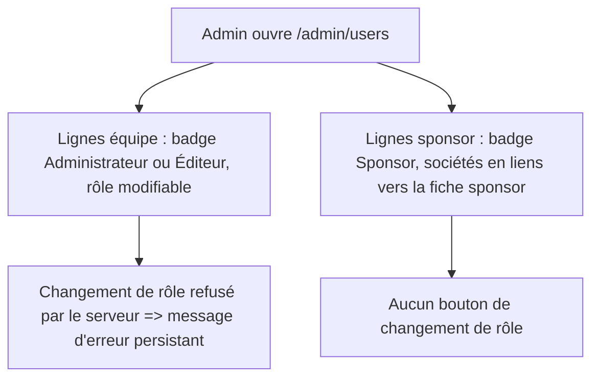
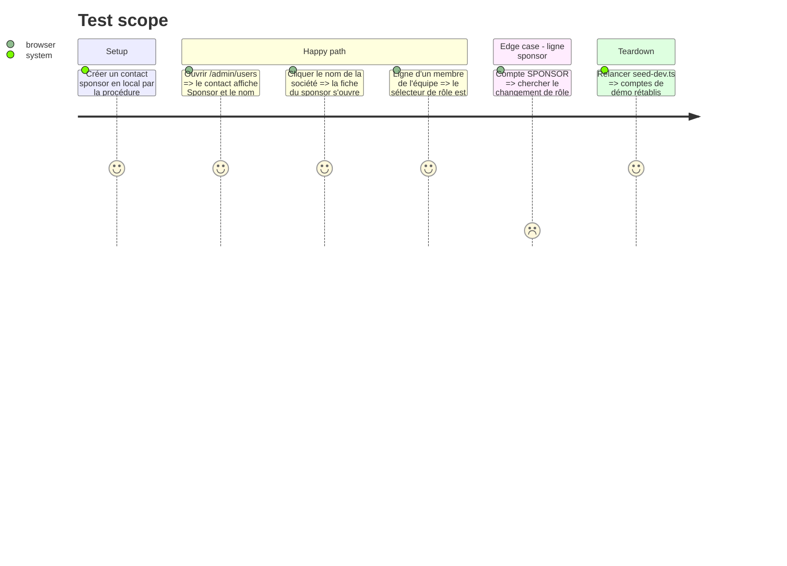

# Instruction: #500 admin — badge Sponsor, sociétés, pas de promotion

## Architecture projection

> Tree of the final files. ✅ create · ✏️ modify · ❌ delete

```txt
.
└── src/frontend/src/app/admin/users/
    └── page.tsx      ✏️ type avec SPONSOR, badge « Sponsor », sociétés liées, pas de sélecteur de rôle pour un sponsor, erreur affichée
```

## User Journey



## Test Scope



## Wireframe

```txt
┌───────────────────────────────────────────────────────────────────┐
│ (1) Utilisateurs                                    [Inviter]      │
├───────────────────────────────────────────────────────────────────┤
│ Nom / e-mail          │ (2) Rôle        │ (3) Société  │ Actions   │
│ Ada · ada@team        │ Administrateur  │ —            │ ✎ ⊘ 🗑    │
│ Bob · bob@acme        │ Sponsor         │ Acme, Beta → │   ⊘ 🗑    │
└───────────────────────────────────────────────────────────────────┘
```

1. En-tête existant, inchangé.
2. Badge de rôle : « Sponsor » distinct ; sélecteur inline seulement pour l'équipe.
3. Sociétés rattachées d'un contact sponsor, chacune en lien vers sa fiche admin ; vide pour l'équipe.

## Tasks to do

### `1)` Type et badge

> Ne plus jamais afficher « Éditeur » pour un sponsor.

1. Type local `role: "ADMIN" | "EDITOR" | "SPONSOR"` et `sponsors`.
2. Badge à trois libellés (Administrateur, Éditeur, Sponsor).

### `2)` Sociétés et sélecteur

> Montrer le rattachement, retirer l'action interdite.

1. Afficher les sociétés en liens vers `/admin/sponsors/<id>`.
2. Ne pas rendre le bouton ni le sélecteur de rôle pour une ligne `SPONSOR`.
3. `handleRôleChange` : succès = 200 uniquement ; sinon message d'erreur persistant (`SaveFeedback` ou équivalent existant), cf. `forms.md`.

### `3)` Vérifier

> Vu marcher, pas seulement compilé.

1. Lint, tests et build frontend.
2. Parcours du Test Scope au navigateur (Chrome DevTools MCP), console propre.

## Test acceptance criteria

| Task | Acceptance criteria |
| ---- | ------------------- |
| 1 | Un contact sponsor s'affiche « Sponsor », jamais « Éditeur » |
| 2 | Ses sociétés sont visibles en liens, et aucune commande ne permet de changer son rôle depuis l'écran |
| 3 | Un refus du serveur reste affiché jusqu'à l'action suivante de l'utilisateur |
