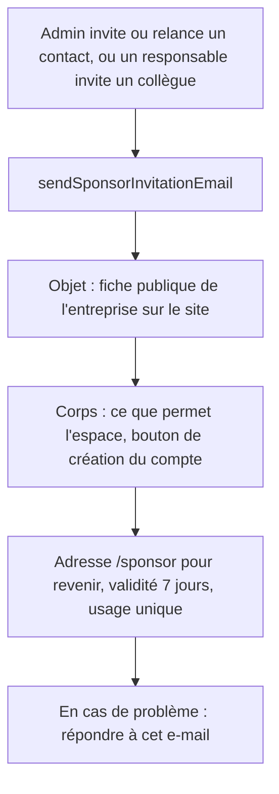
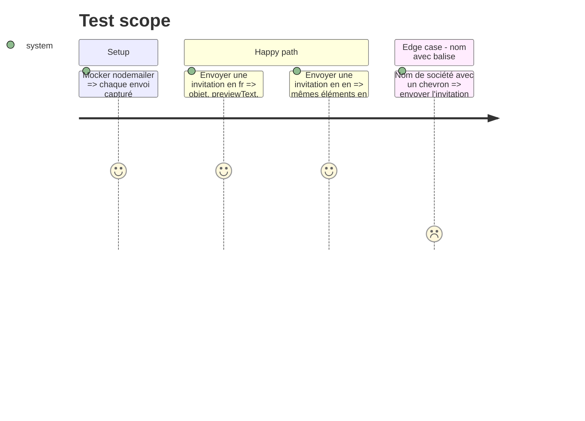

# Instruction: #505 — e-mail d'invitation sponsor qui explique l'espace

## Architecture projection

> Tree of the final files. ✅ create · ✏️ modify · ❌ delete

```txt
.
└── src/backend/src/lib/
    ├── edit-link-email.ts        ✏️ objet, previewText, liste des usages, URL /sponsor, « répondez à cet e-mail », FR et EN, text et html
    └── edit-link-email.test.ts   ✏️ contenu de l'invitation en FR et en EN, échappement du nom
```

## User Journey



## Test Scope



## Tasks to do

### `1)` Tests rouges

> Fixer le contenu attendu avant de l'écrire.

1. Dans `edit-link-email.test.ts`, capturer l'envoi et asserter pour `fr` et `en` : objet, `previewText` différent de l'objet, `${BASE_URL}/sponsor`, la consigne de réponse, la validité de 7 jours, l'usage unique ; nom échappé dans le html.

### `2)` Réécrire l'invitation

> Que l'e-mail fasse le travail des relances.

1. Objet : `[Entreprise] sur le site du DevFest Toulouse — mettez à jour votre fiche` / `[Company] on the DevFest Toulouse website — update your listing`.
2. `previewText` : une phrase d'accroche distincte de l'objet.
3. Liste commune à tous les rôles : fiche publique (logo, description FR/EN, site, réseaux), offres d'emploi, équipe sur le stand, kit de communication, invitation de collègues, mise en ligne dès l'enregistrement.
4. Adresse de retour `${BASE_URL}/sponsor` ; « répondez simplement à cet e-mail » (lien expiré, mauvaise adresse, accès pour quelqu'un d'autre) ; garder adresse exacte, 7 jours, usage unique.
5. Versions `text` et `html`, FR et EN ; pas de `replyTo` (décision du plan).

### `3)` Vérifier dans MailHog

> Lire l'e-mail comme un sponsor.

1. Inviter un contact depuis l'admin local, en FR puis en EN (langue de contact du sponsor).
2. Lire objet, aperçu, rendu html et version texte dans MailHog ; vérifier que le lien et l'adresse `/sponsor` ouvrent les bonnes pages.

## Test acceptance criteria

| Task | Acceptance criteria |
| ---- | ------------------- |
| 1 | Les nouveaux tests échouent sur l'e-mail actuel |
| 2 | L'invitation FR et EN dit à quoi sert l'espace, donne l'adresse `/sponsor` et la consigne de réponse, et garde les mentions de validité |
| 3 | Dans MailHog, l'e-mail s'affiche correctement en html et en texte, dans les deux langues, et ses liens aboutissent |
