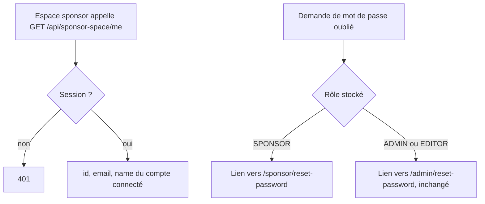
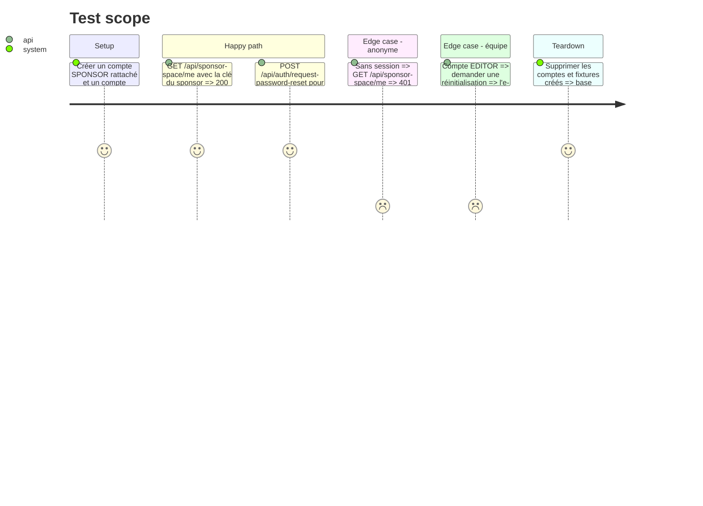

# Instruction: #411 backend — identité et URL de réinitialisation par rôle

## Architecture projection

> Tree of the final files. ✅ create · ✏️ modify · ❌ delete

```txt
.
└── src/backend/src/
    ├── routes/sponsor-space.ts                 ✏️ GET /api/sponsor-space/me → { id, email, name }
    ├── lib/auth.ts                             ✏️ resetUrl selon le rôle stocké (SPONSOR → /sponsor/reset-password)
    └── __tests__/sponsor-space-me.test.ts      ✅ /me authentifié et anonyme, URL de reset par rôle
```

## User Journey



## Test Scope



## Tasks to do

### `1)` Tests rouges

> Fixer le contrat avant de l'écrire.

1. Créer `sponsor-space-me.test.ts` sur le modèle de `sponsor-space-access.test.ts`.
2. Vérifier dans la doc better-auth (Context7) le nom de l'endpoint de demande de réinitialisation et la forme de son corps avant d'écrire le test.

### `2)` Endpoint d'identité

> Donner à l'espace sponsor la personne, pas seulement la société.

1. `GET /sponsor-space/me` à côté de `/mine` : `getAuthContext`, 401 sans session, renvoie `{ id, email, name }` seulement, sans filtre de rôle back-office.

### `3)` URL de réinitialisation

> Ne plus envoyer un sponsor vers le mur de l'admin.

1. Dans `sendResetPassword`, choisir le chemin selon `user.role` ; si le rôle n'arrive pas dans le callback, le relire en base par `user.id`.
2. Garder le texte FR actuel pour l'équipe ; texte adapté « espace partenaire » pour un sponsor.

## Test acceptance criteria

| Task | Acceptance criteria |
| ---- | ------------------- |
| 1 | Les tests échouent sur le code actuel (route absente, lien vers `/admin` pour un sponsor) |
| 2 | Un sponsor connecté obtient son identité ; une requête anonyme reçoit 401 |
| 3 | L'e-mail de réinitialisation d'un sponsor pointe vers `/sponsor/reset-password`, celui de l'équipe reste sur `/admin/reset-password` |
