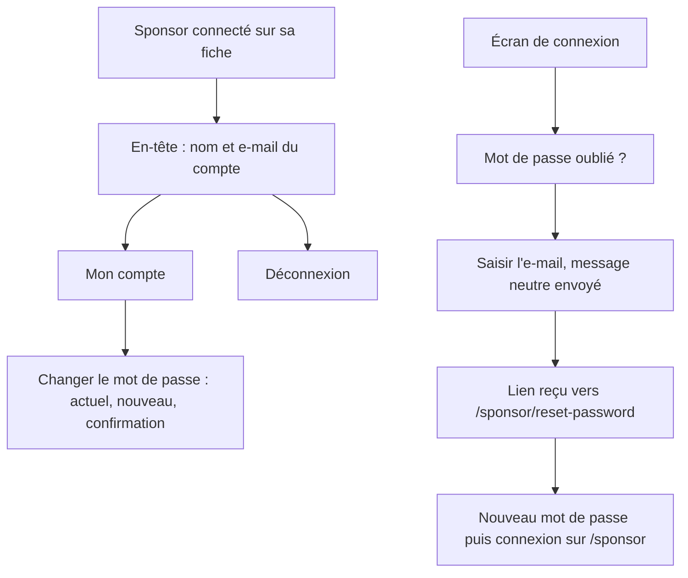
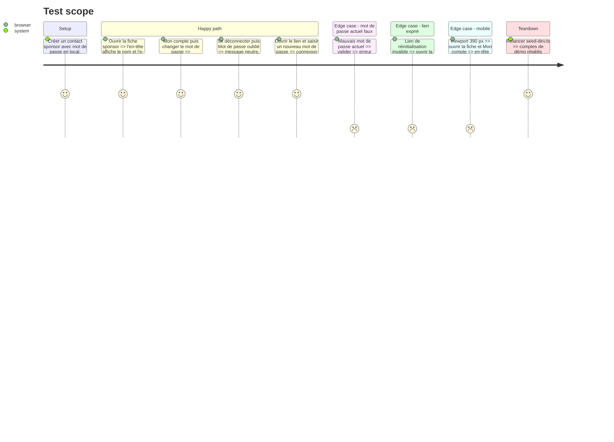

# Instruction: #411 espace sponsor — compte, mot de passe, mot de passe oublié

## Architecture projection

> Tree of the final files. ✅ create · ✏️ modify · ❌ delete

```txt
.
└── src/frontend/src/
    ├── lib/sponsor-api.ts                                  ✏️ getSponsorMe, changePassword, requestPasswordReset (redirect /sponsor)
    ├── components/sponsor-space/SponsorAccountBar.tsx      ✅ identité connectée · Mon compte · Déconnexion
    ├── components/sponsor-space/SponsorAccountBar.test.tsx ✅ rendu de l'identité, lien Mon compte
    ├── components/sponsor-space/SponsorLogin.tsx           ✏️ lien « Mot de passe oublié ? » et formulaire d'envoi
    ├── app/sponsor/[sponsorId]/page.tsx                    ✏️ barre de compte dans l'en-tête, bouton Déconnexion déplacé
    ├── app/sponsor/page.tsx                                ✏️ barre de compte sur le choix de fiche
    ├── app/sponsor/account/page.tsx                        ✅ Mon compte : identité, changement de mot de passe
    └── app/sponsor/reset-password/page.tsx                 ✅ nouveau mot de passe depuis le lien reçu
```

## User Journey



## Test Scope



## Wireframe

```txt
┌──────────────────────────────────────────────────────────┐
│ (1) [logo] DevFest Toulouse      (2) Bob · bob@acme.fr ▾  │
│                                      Mon compte · Déconnexion
├──────────────────────────────────────────────────────────┤
│ (3) Acme — Espace partenaire · Responsable                │
│ [Fiche publique] [Offres] [Infos privées] [Accès]         │
└──────────────────────────────────────────────────────────┘

┌────────────────────────────────┐   ┌────────────────────────────────┐
│ (4) Mon compte                 │   │ (6) Nouveau mot de passe       │
│ Nom · e-mail                   │   │ [nouveau]                      │
│ (5) Mot de passe               │   │ [confirmation]                 │
│ [actuel] [nouveau] [confirmer] │   │ [Valider]                      │
│ [Enregistrer]   ← Mes fiches   │   │ lien expiré → Se connecter     │
└────────────────────────────────┘   └────────────────────────────────┘
```

1. En-tête existant (logo DevFest).
2. Barre de compte : la personne connectée, avec Mon compte et Déconnexion.
3. Titre de la société et onglets, inchangés ; le bouton Déconnexion actuel rejoint (2).
4. Page Mon compte : identité en lecture seule.
5. Changement de mot de passe, mêmes règles que l'admin (10 caractères minimum, confirmation).
6. Page de réinitialisation, à l'identité DevFest partenaire et non « DevFest Admin ».

## Tasks to do

### `1)` Client API

> Une seule porte vers le backend.

1. `getSponsorMe()`, `changeSponsorPassword()` (`/api/auth/change-password`, comme `admin/profile`) et `requestSponsorPasswordReset(email)` avec `redirectTo` vers `/sponsor/reset-password`.

### `2)` Barre de compte

> Savoir avec quelle adresse on est connecté.

1. `SponsorAccountBar` : nom et e-mail, liens Mon compte et Déconnexion ; test de rendu.
2. L'insérer dans l'en-tête de `[sponsorId]/page.tsx` et sur `/sponsor` ; retirer le bouton Déconnexion isolé.

### `3)` Mon compte

> Changer son mot de passe sans passer par l'équipe.

1. `/sponsor/account` : identité, formulaire de changement de mot de passe (règles de `admin/profile`), retour vers les fiches ; 401 → `/sponsor/login?next=/sponsor/account`.
2. Erreur persistante, succès effacé (`forms.md`).

### `4)` Mot de passe oublié

> Activer le parcours seulement maintenant que le lien pointe au bon endroit (phase 4).

1. `SponsorLogin` : lien « Mot de passe oublié ? » en mode connexion, formulaire e-mail, message neutre identique que le compte existe ou non.
2. `/sponsor/reset-password` : reprise de la logique de `admin/reset-password` (token, erreurs), habillage partenaire, redirection vers `/sponsor` en cas de succès.

### `5)` Vérifier

> Vu marcher, sur ordinateur et sur téléphone.

1. Lint, tests, build frontend.
2. Test Scope complet au navigateur, MailHog pour l'e-mail de réinitialisation, rendu mobile par `emulate`.

## Test acceptance criteria

| Task | Acceptance criteria |
| ---- | ------------------- |
| 1 | Les trois appels atteignent le backend et remontent ses erreurs telles quelles |
| 2 | Sur chaque écran connecté de l'espace partenaire, le nom et l'e-mail du compte sont visibles, avec Mon compte et Déconnexion |
| 3 | Un sponsor change son mot de passe et se reconnecte avec le nouveau ; un mot de passe actuel faux affiche une erreur qui reste |
| 4 | Un sponsor qui a oublié son mot de passe reçoit un lien vers l'espace partenaire, en choisit un nouveau et arrive sur sa fiche |
| 5 | Le parcours tient à 390 px sans débordement horizontal, console propre |
