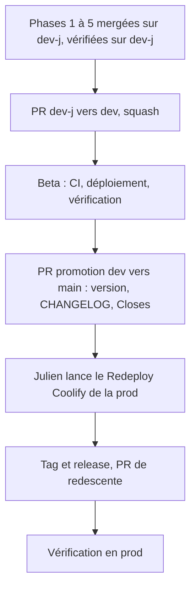

# Instruction: Mise en production de la vague 1 (avec #507 et #386)

## Architecture projection

> Tree of the final files. ✅ create · ✏️ modify · ❌ delete

```txt
.
├── CHANGELOG.md     ✏️ section de la nouvelle version (via la skill deploy-to-prod)
└── (version)        ✏️ bump SemVer porté par la PR de promotion, selon la skill
```

## User Journey



## Test Scope

```mermaid
---
title: Test scope
---
journey
  section Setup
    dev-j porte #500 #505 #411 #507 #386, CI verte, déploiement dev-j finished => prêt à promouvoir: 5: system
  section Happy path
    Ouvrir /api/health en prod => version de la release: 5: api
    Ouvrir /conferences-list en prod => 200 sur /fr/conferences: 5: api
    Importer depuis Billetweb en prod avec la source site => les trois tarifs gardent src=site: 5: browser
    Ouvrir /admin/users en prod => les contacts sponsor affichent Sponsor: 5: browser
  section Edge case - faux conflits après squash
    PR dev-j vers dev en conflit add/add => appliquer la procédure git-workflow.md => diff vide avec dev-j: 1: cli
```

## Tasks to do

### `1)` Promotion vers la beta

> Faire passer la vague par l'environnement de recette.

1. Suivre la skill `deploy-to-prod` ; présenter à Julien la PR `dev-j → dev` avant de l'ouvrir.
2. Après merge : CI lue, déploiement beta `finished`, vérification sur `beta.site.devfesttoulouse.fr`.

### `2)` Promotion vers la prod

> Une seule release qui embarque toute la vague.

1. PR `dev → main` par la skill : bump, CHANGELOG, `Closes #500 #505 #411 #507` (et la redirection de #386, issue déjà fermée).
2. Merge après accord ; Julien lance le Redeploy Coolify (jamais automatique sur `main`).
3. Tag `vX.Y.Z` égal à `APP_VERSION`, release au format des précédentes, PR de redescente vers `dev` puis remontée sur `dev-j`.

### `3)` Vérifier en prod

> Constater, puis seulement après rouvrir l'import Billetweb.

1. Parcours du Test Scope en prod.
2. Réimport Billetweb avec `site` par Julien, puis vérification des URLs des tarifs ; mise à jour de #507.

## Test acceptance criteria

| Task | Acceptance criteria |
| ---- | ------------------- |
| 1 | La beta sert la vague complète et ses vérifications passent |
| 2 | La release est taguée, les issues embarquées sont fermées par la PR de promotion, la PR de redescente est ouverte |
| 3 | En prod, la redirection, le badge Sponsor et l'import avec suivi fonctionnent ; un réimport ne retire plus `src=site` |
