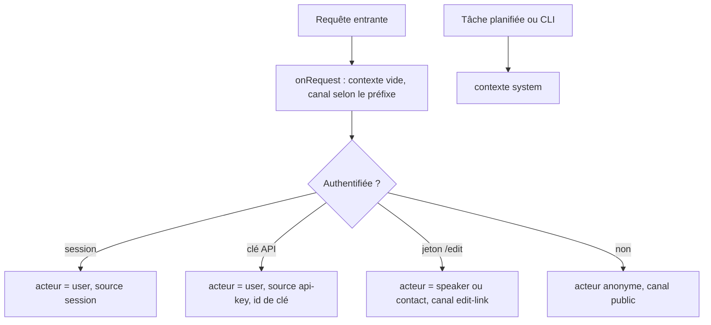
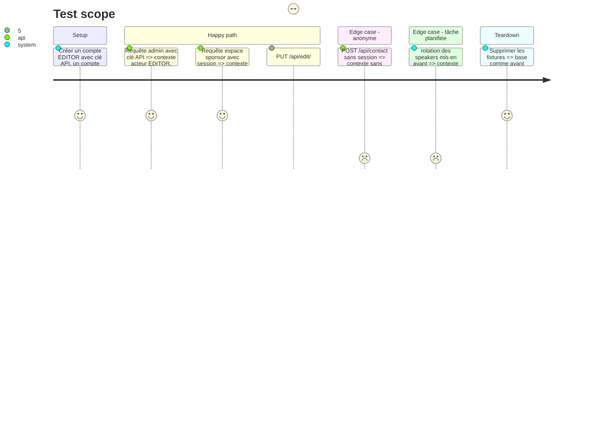

# Instruction: #513 — table `AuditLog` et contexte de requête

## Architecture projection

> Tree of the final files. ✅ create · ✏️ modify · ❌ delete

```txt
.
└── src/backend/
    ├── prisma/schema.prisma                                   ✏️ modèle AuditLog (+ index) et enums AuditAction, AuditChannel
    ├── prisma/migrations/<ts>_audit_log/migration.sql         ✅ migration écrite à la main
    ├── src/lib/request-context.ts                             ✅ AsyncLocalStorage : acteur, canal, ip ; helpers runWith / current
    ├── src/lib/auth-context.ts                                ✏️ getAuthContext renseigne l'acteur et la source (session, apiKey + id de clé)
    ├── src/index.ts                                           ✏️ hook onRequest global : contexte vide, canal déduit du préfixe de route
    ├── src/routes/edit.ts                                     ✏️ acteur = speaker ou contact résolu par le jeton, canal edit-link
    ├── src/routes/admin/import.ts                             ✏️ canal import pendant importSessionize
    ├── src/lib/scheduler.ts                                   ✏️ tâches planifiées dans un contexte « system »
    ├── src/routes/maintenance.ts                              ✏️ purge : système (secret) ou utilisateur
    └── src/__tests__/request-context.test.ts                  ✅ acteur et canal résolus pour chaque entrée
```

## User Journey



## Test Scope



## Tasks to do

### `1)` Modèle et migration

> Une table qui ne fait que grandir, indexée pour les trois filtres de l'écran.

1. `AuditLog` : id (bigint), createdAt, action (`CREATE`/`UPDATE`/`DELETE`/`TRASH`/`RESTORE`), entity (nom du modèle), entityId (texte), channel (`ADMIN`/`SPONSOR`/`EDIT_LINK`/`IMPORT`/`API_KEY`/`MCP`/`PUBLIC`/`SYSTEM`/`AUTH`), actorUserId (nullable, `onDelete: SetNull`), actorLabel (texte figé : nom ou « speaker #12 »), apiKeyId (nullable), changes (JSON : champs avant/après), ip (nullable).
2. Index : (entity, entityId, createdAt), (actorUserId, createdAt), (channel, createdAt), (createdAt).
3. Migration écrite à la main (`database.md`), appliquée en local par `migrate deploy`.

### `2)` Contexte de requête

> Savoir qui agit, partout, sans le passer de fonction en fonction.

1. `request-context.ts` : `AsyncLocalStorage<{ actor?, channel, apiKeyId?, ip? }>`, `runInContext`, `getRequestContext`, `setActor`.
2. Hook `onRequest` global : `runInContext` pour toute la requête, canal par défaut selon le préfixe (`/api/admin` → ADMIN, `/api/sponsor-space` → SPONSOR, `/api/edit` → EDIT_LINK, `/api/auth` → AUTH, sinon PUBLIC).
3. `getAuthContext` appelle `setActor` ; la source `apiKey` passe le canal à API_KEY et garde l'id de clé.
4. Entrées sans compte : `/edit` (speaker ou contact résolu par le jeton), import Sessionize (IMPORT, acteur = l'admin), scheduler et purge (SYSTEM), CLI d'import d'historique (SYSTEM).

### `3)` Tests

> Prouver le contexte avant d'y brancher l'écriture.

1. `request-context.test.ts` : une route de test qui renvoie `getRequestContext()`, appelée par chaque canal.

## Test acceptance criteria

| Task | Acceptance criteria |
| ---- | ------------------- |
| 1 | La migration s'applique sur une base fraîche et sur la base locale existante |
| 2 | Chaque canal (admin session, admin clé API, sponsor, edit-link, import, public, system) produit le bon acteur et le bon canal dans le contexte |
| 3 | Les tests passent et échouent si on retire le hook ou l'appel à `setActor` |
