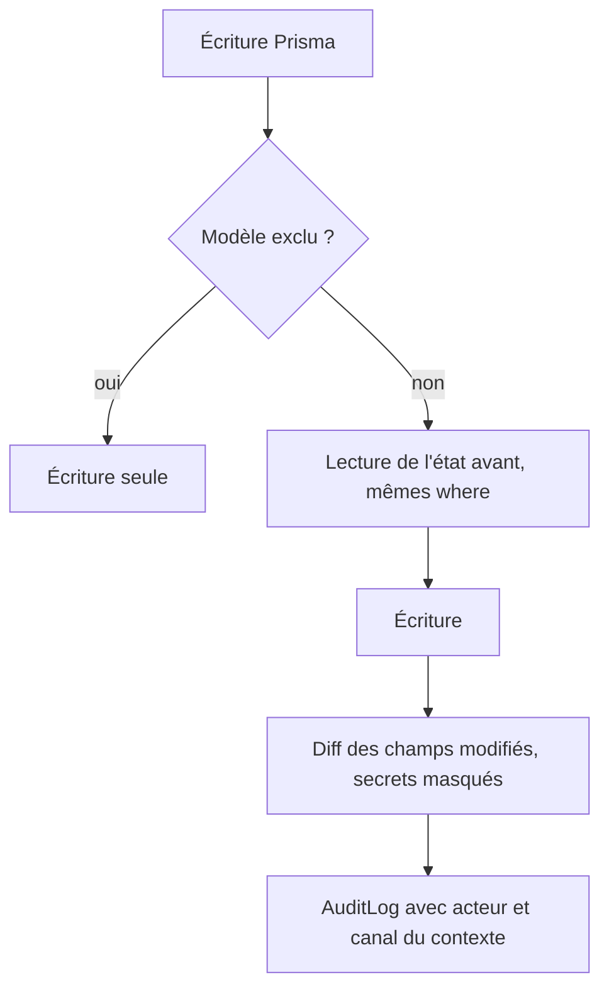
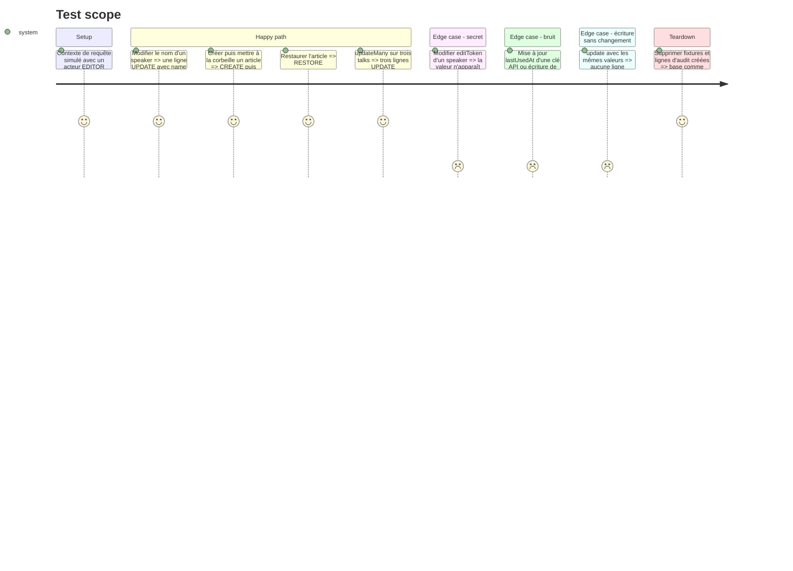

# Instruction: #513 — extension Prisma qui trace toute écriture

## Architecture projection

> Tree of the final files. ✅ create · ✏️ modify · ❌ delete

```txt
.
└── src/backend/src/
    ├── lib/audit.ts                          ✅ extension $extends : capture avant/après, masquage, classement TRASH/RESTORE
    ├── lib/prisma.ts                         ✏️ exporte le client étendu sous le même nom `prisma`
    ├── lib/featured-speakers.ts              ✏️ transaction rendue compatible (client étendu dans la transaction)
    └── __tests__/audit-log.test.ts           ✅ une écriture par canal, bulk, soft delete, masquage, exclusions
```

## User Journey



## Test Scope



## Tasks to do

### `1)` Tests rouges

> Fixer le comportement avant l'extension.

1. `audit-log.test.ts` sur les cas du Test Scope, assertions sur les lignes `AuditLog` réellement écrites.

### `2)` Extension

> Un seul point de passage pour toutes les écritures.

1. `$allOperations` sur `create`, `update`, `upsert`, `delete`, `createMany`, `updateMany`, `deleteMany` ; état avant lu avec le client de base (pas de récursion).
2. Bulk : `findMany` avec le même `where` avant l'écriture, une ligne par enregistrement ; plafond de garde (par ex. 5 000) au-delà duquel une ligne de synthèse remplace le détail (`code-quality.md`).
3. Exclusions : `AuditLog`, `Session`, `Verification`, `Account`, tables OAuth, `TranslationLog` ; sur `ApiKey`, ignorer une écriture qui ne touche que `lastUsedAt`.
4. Masquage : `password`, `editToken`, `invitationToken`, `hashedKey`, `accessToken`, `refreshToken`, `idToken`, `token` → « masqué ».
5. Classement : `deletedAt` passant de null à une date → TRASH, l'inverse → RESTORE.
6. Écriture d'audit qui ne casse jamais l'écriture métier : échec journalisé, pas propagé.
7. `featured-speakers.ts` : vérifier que la transaction passe par le client étendu.

### `3)` Non-régression

> Le client étendu ne doit rien changer d'autre.

1. Suite backend complète, typecheck, seeds dev et CI sur base fraîche (les seeds écrivent beaucoup : vérifier le temps et le volume d'audit produit, canal SYSTEM).

## Test acceptance criteria

| Task | Acceptance criteria |
| ---- | ------------------- |
| 1 | Les tests échouent sans l'extension |
| 2 | Toute écriture d'un modèle suivi produit une ligne avec acteur, canal, entité, id et champs avant/après, secrets masqués ; les écritures exclues n'en produisent aucune |
| 3 | Suite backend, typecheck et seed-dev passent ; aucune route ne change de comportement |
