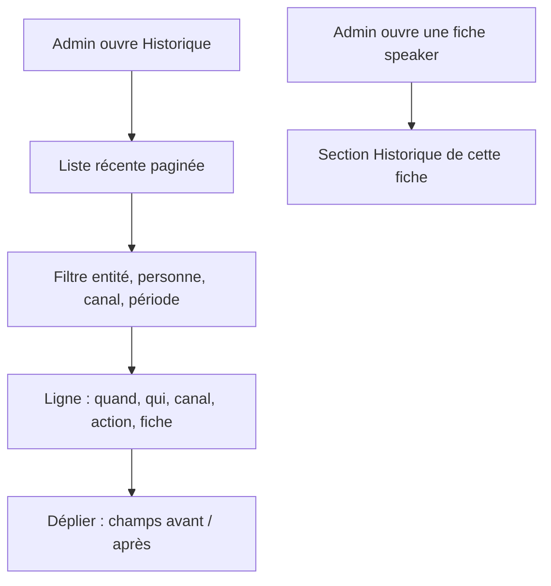
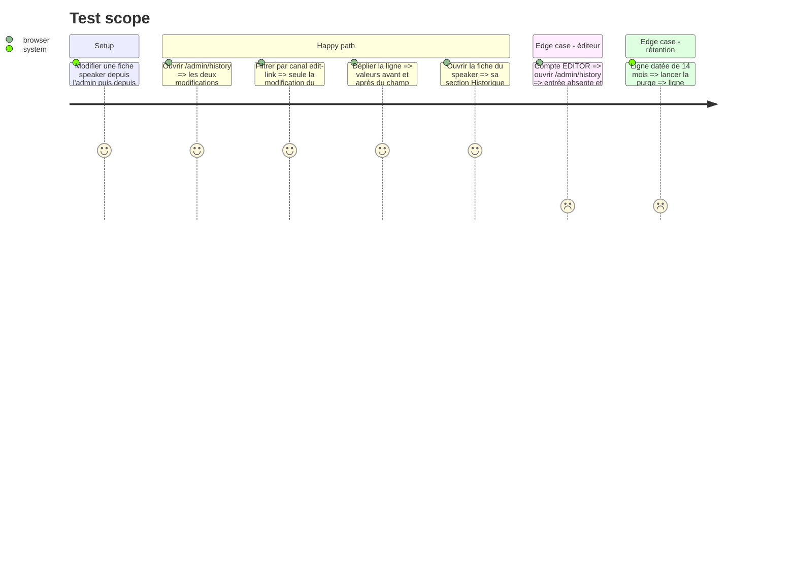

# Instruction: #513 — écran Historique, historique par fiche, purge à 13 mois

## Architecture projection

> Tree of the final files. ✅ create · ✏️ modify · ❌ delete

```txt
.
├── src/backend/src/
│   ├── routes/admin/audit.ts                           ✅ GET /api/admin/audit (filtres entité, personne, canal, période ; paginé)
│   ├── routes/admin/index.ts                           ✏️ enregistrement, réservé ADMIN
│   ├── lib/audit-purge.ts                              ✅ suppression des lignes de plus de 13 mois
│   ├── lib/scheduler.ts                                ✏️ purge quotidienne
│   └── __tests__/admin-audit.test.ts                   ✅ filtres, pagination, accès ADMIN seul, purge
└── src/frontend/src/
    ├── app/admin/history/page.tsx                      ✅ écran Historique
    ├── components/admin/AuditTrail.tsx                 ✅ historique d'une fiche (entité + id)
    ├── components/admin/nav-items.ts                   ✏️ entrée « Historique » (ADMIN)
    └── app/admin/{speakers,talks,sponsors,articles}/[id]/page.tsx  ✏️ section Historique de la fiche
```

## User Journey



## Test Scope



## Wireframe

```txt
┌──────────────────────────────────────────────────────────────────────┐
│ (1) Historique                                                        │
│ [Entité ▾] [Personne ▾] [Canal ▾] [Du … au …]                         │
├──────────────────────────────────────────────────────────────────────┤
│ (2) 04/10 18:02 · Julien (admin) · Modifié · Speaker « Ada L. »  ▸    │
│     04/10 17:55 · speaker #12 (lien) · Modifié · Talk « Kotlin… » ▸   │
│     ▾ (3) bioFr : « … » → « … »    company : « A » → « B »            │
├──────────────────────────────────────────────────────────────────────┤
│ (4) ← Précédent   page 1   Suivant →                                  │
└──────────────────────────────────────────────────────────────────────┘
```

1. Filtres combinables.
2. Une ligne par écriture : date, auteur et canal, action, lien vers la fiche.
3. Détail dépliable des champs avant/après, secrets déjà masqués côté serveur.
4. Pagination (`#416` : jamais de liste sans limite).

## Tasks to do

### `1)` API et purge

> Lire vite, garder 13 mois.

1. `GET /api/admin/audit` : filtres, tri décroissant, pagination par curseur ; ADMIN seul (données personnelles).
2. Purge quotidienne dans le scheduler, seuil 13 mois en constante nommée.

### `2)` Écrans

> Répondre à « qui a changé ça ? » en deux clics.

1. `/admin/history` selon le wireframe ; entrée de menu ADMIN.
2. `AuditTrail` sur les fiches speaker, talk, sponsor, article.

### `3)` Vérifier

> Vu marcher, avec de vraies modifications.

1. Tests backend, lint, tests et build frontend ; parcours du Test Scope au navigateur.

## Test acceptance criteria

| Task | Acceptance criteria |
| ---- | ------------------- |
| 1 | L'API filtre et pagine, refuse un EDITOR, et la purge ne garde que 13 mois |
| 2 | Une modification faite depuis chaque canal apparaît avec auteur et canal ; une fiche montre son propre historique avec avant/après |
| 3 | Lint, tests et build verts ; parcours vu au navigateur, console propre |
