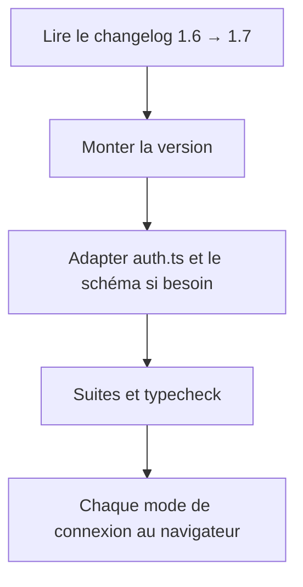
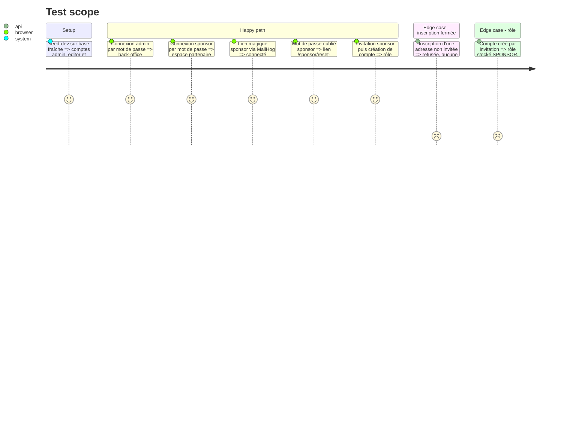

# Instruction: #514 — montée de better-auth 1.6.23 → 1.7.7

## Architecture projection

> Tree of the final files. ✅ create · ✏️ modify · ❌ delete

```txt
.
└── src/
    ├── backend/package.json, pnpm-lock.yaml        ✏️ better-auth ^1.7.7 (et dépendances liées)
    ├── backend/src/lib/auth.ts                     ✏️ adaptations d'API relevées dans le changelog 1.7
    ├── backend/prisma/schema.prisma + migration    ✏️ seulement si 1.7 change le schéma de ses tables
    └── frontend/package.json, pnpm-lock.yaml       ✏️ si le client better-auth y est utilisé
```

## User Journey



## Test Scope



## Tasks to do

### `1)` Lire avant de monter

> Ne pas découvrir une rupture en prod.

1. Changelog et guide de migration better-auth 1.7 : ruptures sur `databaseHooks`, `additionalFields`, `magicLink`, `prismaAdapter`, schéma.

### `2)` Monter et adapter

> Une montée de version seule, sans fonctionnalité.

1. Monter `better-auth` à 1.7.7 dans le conteneur ; régénérer Prisma ; migration à la main si le schéma change.
2. Adapter `auth.ts` aux changements relevés.

### `3)` Prouver l'absence de régression

> L'authentification de tout le site en dépend.

1. Suites backend (dont `auth-signup-gate`, sponsor, admin-users) et frontend, typecheck, build.
2. Parcours du Test Scope au navigateur ; OAuth Google/GitHub sur `dev-j` seulement (identifiants absents en local).
3. PR dédiée vers `dev-j`.

## Test acceptance criteria

| Task | Acceptance criteria |
| ---- | ------------------- |
| 1 | Les ruptures applicables sont listées dans la PR, ou leur absence affirmée |
| 2 | Le backend démarre en 1.7.7 et `migrate deploy` passe sur base fraîche |
| 3 | Mot de passe, lien magique, réinitialisation, invitation et inscription fermée se comportent comme avant ; rôle stocké correct |
