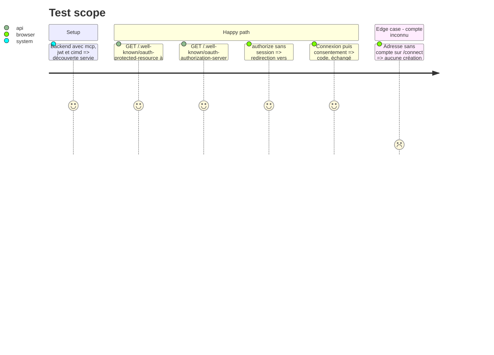

# Instruction: #514 — serveur OAuth MCP et page de connexion des agents

## Architecture projection

> Tree of the final files. ✅ create · ✏️ modify · ❌ delete

```txt
.
├── src/backend/
│   ├── package.json                                   ✏️ @better-auth/mcp, @better-auth/cimd
│   ├── src/lib/auth.ts                                ✏️ plugins jwt(), mcp({ loginPage, resource }), cimd()
│   ├── src/index.ts                                   ✏️ /api/auth : parser form-urlencoded, limite de débit OAuth distincte
│   ├── prisma/schema.prisma + migration               ✏️ oauthClient, oauthAccessToken, oauthRefreshToken, oauthConsent, oauthClientAssertion, jwks
│   └── src/__tests__/mcp-oauth.test.ts                ✅ découverte, authorize sans session, token form-urlencoded
└── src/frontend/
    ├── next.config.ts                                 ✏️ réécritures /.well-known/* vers le backend
    ├── src/proxy.ts                                   ✏️ /.well-known hors next-intl
    ├── src/app/connect/page.tsx                       ✅ connexion d'un agent : mot de passe, Google, GitHub, lien magique, puis reprise de l'autorisation
    └── src/app/connect/consent/page.tsx               ✅ consentement (option consentPage du plugin)
```

## User Journey

```mermaid
flowchart TD
  A[Client MCP lit /.well-known/oauth-protected-resource] --> B[Serveur d'autorisation /api/auth]
  B --> C[/oauth2/authorize sans session]
  C --> D[/connect : l'utilisateur se connecte]
  D --> E[Consentement : nom de l'agent, droits = les vôtres]
  E --> F[Code PKCE puis jeton lié à la ressource /api/mcp]
```

## Test Scope



## Tasks to do

### `1)` Serveur d'autorisation

> better-auth devient le serveur OAuth du site, sans second système d'identité.

1. Installer `@better-auth/mcp` et `@better-auth/cimd` (vérifier les API dans les types installés) ; `jwt()` + `mcp({ loginPage: "/connect", consentPage: "/connect/consent", resource: "<BASE_URL>/api/mcp" })` + `cimd({ fetchClientMetadataResource, metadataProfile: "mcp-2026-07-28" })`, le fetcher venant de `@better-auth/cimd/node`. Ne **pas** ajouter `oauthProvider()` en plus : `mcp()` l'embarque (doc Context7, 2026-10-04).
2. Schéma des tables OAuth par la CLI better-auth, migration écrite à la main.
3. `/api/auth` : accepter `application/x-www-form-urlencoded` ; limite de débit propre aux endpoints OAuth.

### `2)` Découverte à l'origine publique

> Un client MCP doit trouver le serveur sans configuration.

1. Réécritures Next `/.well-known/oauth-*` vers le backend, exclues de next-intl ; vérifier par `curl` en local puis sur `dev-j`.

### `3)` Page de connexion d'un agent

> Une page neutre, valable pour l'équipe comme pour les sponsors.

1. `/connect` : mêmes moyens que les écrans existants, inscription toujours fermée (hook `user.create.before` inchangé), puis reprise de l'autorisation.
2. Écran de consentement : nom du client, « agira avec vos droits », accepter/refuser.

## Test acceptance criteria

| Task | Acceptance criteria |
| ---- | ------------------- |
| 1 | Un échange authorize + PKCE + token aboutit à un jeton lié à `/api/mcp` |
| 2 | Les deux documents `.well-known` répondent en JSON à l'origine publique, en local et sur `dev-j` |
| 3 | Un admin et un sponsor se connectent sur `/connect`, consentent, et le client reçoit un jeton ; une adresse sans compte n'en crée pas |
