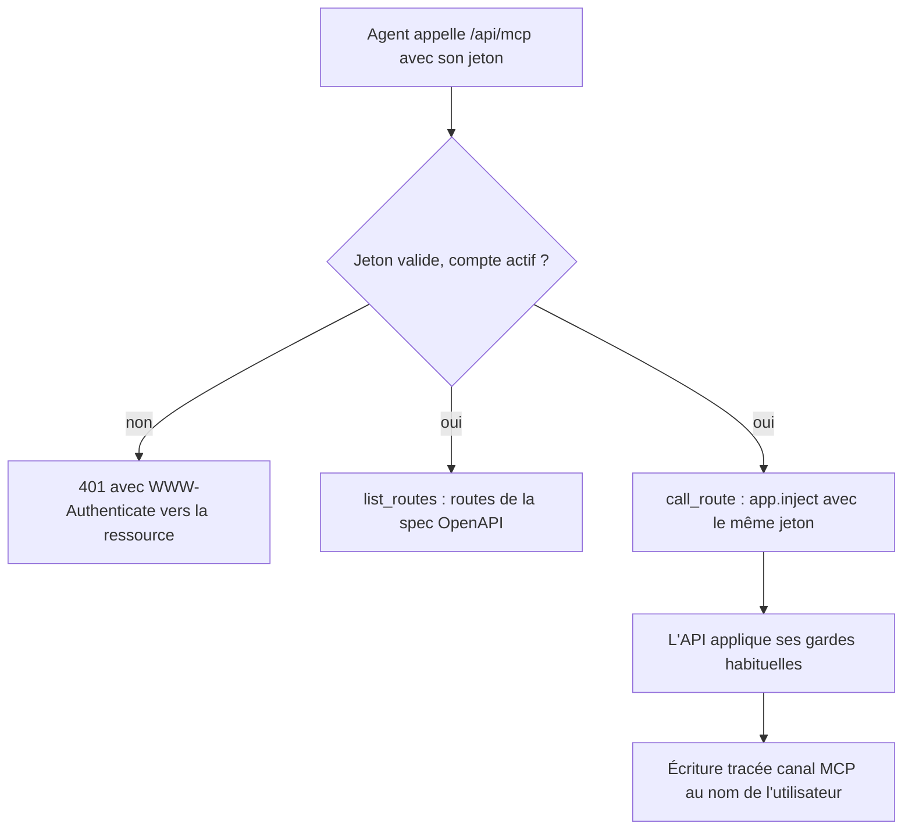
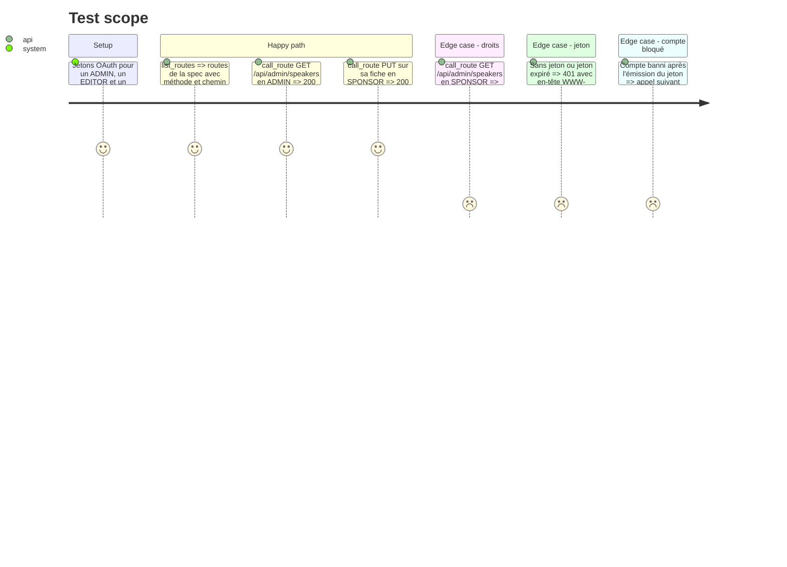

# Instruction: #514 — jeton OAuth accepté par l'API et serveur MCP `/api/mcp`

## Architecture projection

> Tree of the final files. ✅ create · ✏️ modify · ❌ delete

```txt
.
├── src/backend/
│   ├── package.json                               ✏️ @modelcontextprotocol/server + @modelcontextprotocol/node (SDK v2 : le transport HTTP est dans le paquet node)
│   ├── src/lib/auth-context.ts                    ✏️ 3e source : jeton OAuth vérifié par better-auth, source mcp, compte banni ou supprimé refusé
│   ├── src/lib/request-context.ts                 ✏️ canal MCP
│   ├── src/plugins/swagger.ts                     ✏️ spec générée en interne même quand l'UI est coupée en prod
│   ├── src/routes/mcp.ts                          ✅ POST /api/mcp sans état : outils list_routes et call_route
│   └── src/__tests__/mcp-server.test.ts           ✅ outils, droits hérités, 401 sans jeton
└── src/frontend/next.config.ts                    ✏️ réécriture /api/mcp vers le backend
```

## User Journey



## Test Scope



## Tasks to do

### `1)` Le jeton comme moyen d'authentification

> L'API reconnaît l'agent comme l'utilisateur, ni plus ni moins.

1. `getAuthContext` : après la session et la clé d'API, vérifier un jeton OAuth (audience `/api/mcp`) ; relire l'utilisateur, refuser banni ou supprimé ; source et canal MCP.

### `2)` Serveur MCP

> Deux outils génériques, aucune règle d'accès dans le connecteur.

1. `POST /api/mcp` avec le SDK v2 en mode sans état : par requête, un `McpServer` (il porte le jeton de l'agent) et un `NodeStreamableHTTPServerTransport({ sessionIdGenerator: undefined })`, `handleRequest(request.raw, reply.raw, request.body)`, puis `transport.close()` et `server.close()` sur `reply.raw` `close`. Fastify doit rendre la main (`reply.hijack()`). GET/DELETE en 405.
2. `list_routes` depuis `app.swagger()` (méthode, chemin, résumé, paramètres) ; `call_route` via `app.inject` en transmettant le jeton de l'agent ; réponse relayée telle quelle (statut, corps).
3. Refuser `call_route` vers `/api/mcp` et `/api/auth/*` (pas de récursion, pas de gestion de comptes par l'agent).

### `3)` Vérifier avec un vrai client

> Un agent réel, pas seulement des tests.

1. Brancher Claude (ou l'inspecteur MCP) sur `dev-j`, parcourir le flux OAuth complet, appeler une lecture et une écriture.

## Test acceptance criteria

| Task | Acceptance criteria |
| ---- | ------------------- |
| 1 | Un jeton valide donne exactement les droits de son utilisateur ; banni, supprimé ou expiré → refus |
| 2 | Un sponsor reçoit 403 sur `/api/admin/*` via l'agent ; une écriture faite via MCP apparaît dans l'historique avec la mention MCP |
| 3 | Un client MCP réel se connecte à `dev-j` par OAuth et appelle les deux outils |
