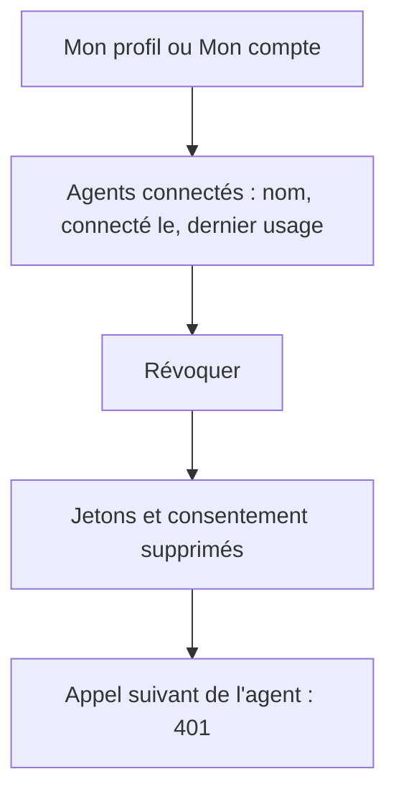
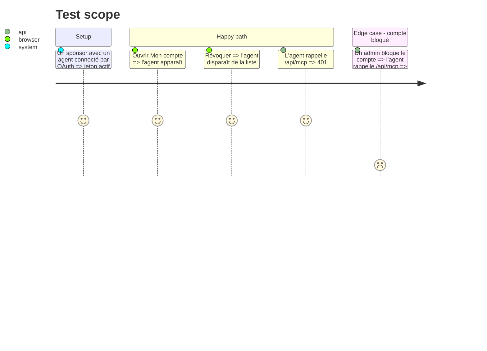

# Instruction: #514 — agents connectés : liste et révocation

## Architecture projection

> Tree of the final files. ✅ create · ✏️ modify · ❌ delete

```txt
.
├── src/backend/src/
│   ├── routes/me/agents.ts                         ✅ GET /api/me/agents, DELETE /api/me/agents/:clientId (tout compte)
│   ├── routes/admin/users.ts                       ✏️ bannir ou supprimer un compte révoque ses jetons OAuth
│   └── __tests__/me-agents.test.ts                 ✅ liste, révocation, effet sur l'appel suivant
└── src/frontend/src/
    ├── components/account/ConnectedAgents.tsx      ✅ liste et bouton Révoquer
    ├── app/admin/profile/page.tsx                  ✏️ section Agents connectés
    └── app/sponsor/account/page.tsx                ✏️ section Agents connectés
```

## User Journey



## Test Scope



## Tasks to do

### `1)` API

> Chacun contrôle ses propres agents.

1. Lister les clients ayant un jeton ou un consentement actif pour l'utilisateur ; révoquer = supprimer jetons d'accès, de rafraîchissement et consentement (via l'API du plugin si elle existe, sinon Prisma).
2. Bannir ou supprimer un compte révoque ses jetons.

### `2)` Écrans

> Visible là où l'utilisateur gère déjà son compte.

1. `ConnectedAgents` dans le profil admin et dans Mon compte sponsor, avec confirmation avant révocation.

## Test acceptance criteria

| Task | Acceptance criteria |
| ---- | ------------------- |
| 1 | Après révocation ou blocage, l'appel suivant de l'agent échoue |
| 2 | Un admin et un sponsor voient leurs agents et en révoquent un depuis leur écran de compte |
