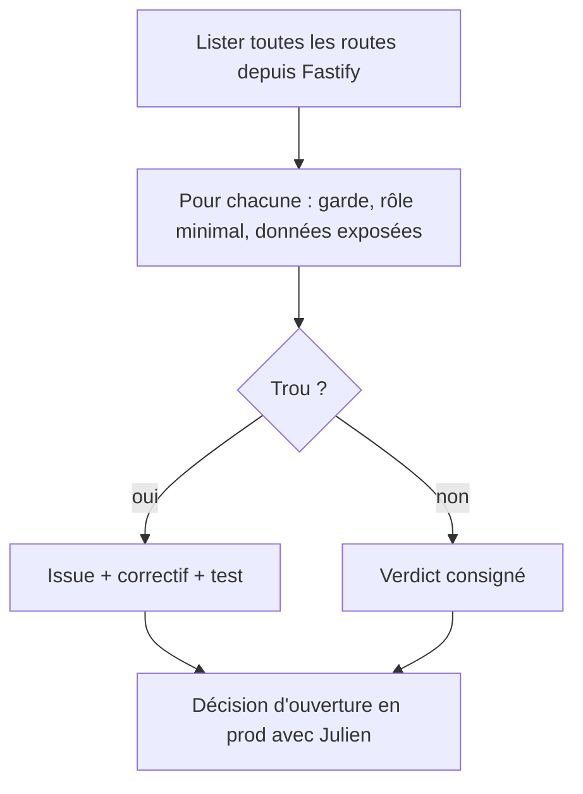
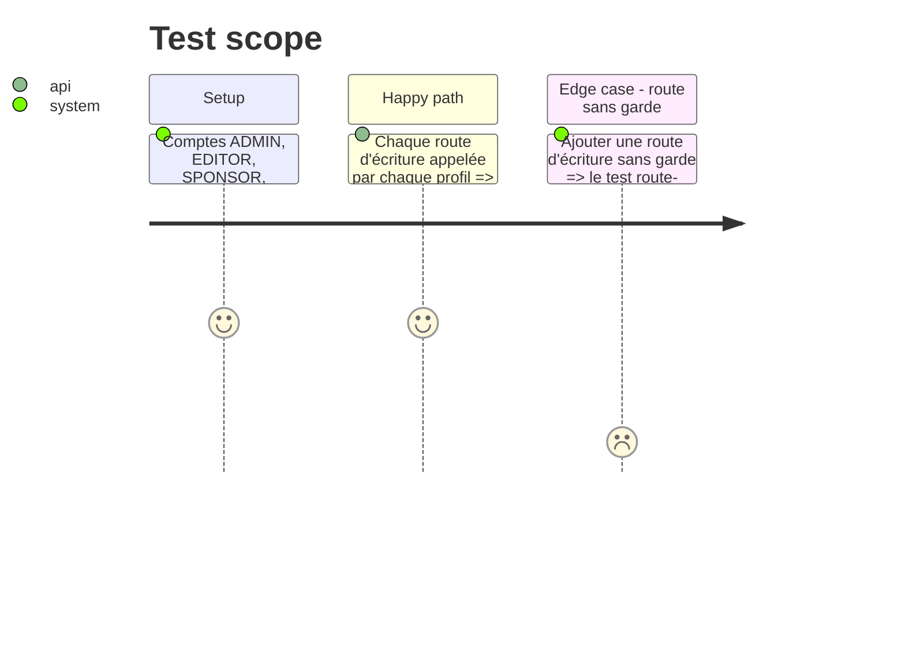

# Instruction: #514 — audit des droits de l'API, condition d'ouverture en prod

## Architecture projection

> Tree of the final files. ✅ create · ✏️ modify · ❌ delete

```txt
.
├── docs/audit-droits-api.md                         ✅ inventaire : chaque route, sa garde, le rôle minimal, verdict
├── src/backend/src/__tests__/route-guards.test.ts   ✅ test qui échoue si une route d'écriture n'a pas de garde déclarée
└── src/backend/src/routes/**                        ✏️ correctifs des trous trouvés (une PR par trou significatif)
```

## User Journey



## Test Scope



## Tasks to do

### `1)` Inventaire

> Savoir ce que l'agent pourra toucher.

1. Extraire les ~190 routes de Fastify ; pour chacune : garde, rôle minimal, données personnelles exposées ; consigner dans `docs/audit-droits-api.md`.

### `2)` Garde-fou permanent

> Qu'une future route ne rouvre pas la porte.

1. `route-guards.test.ts` : toute route non GET hors liste blanche publique doit porter une garde connue.

### `3)` Correctifs et décision

> Ouvrir en prod en connaissance de cause.

1. Chaque trou : issue, correctif, test.
2. Présenter le verdict à Julien ; ouverture en prod du connecteur seulement s'il est accepté (décision du 2026-10-04 : avant l'événement si l'audit passe).

## Test acceptance criteria

| Task | Acceptance criteria |
| ---- | ------------------- |
| 1 | Chaque route a un verdict écrit |
| 2 | Le test échoue sur une route d'écriture sans garde |
| 3 | Aucun trou connu ouvert au moment d'ouvrir le connecteur en prod, et la décision est écrite sur #514 |
