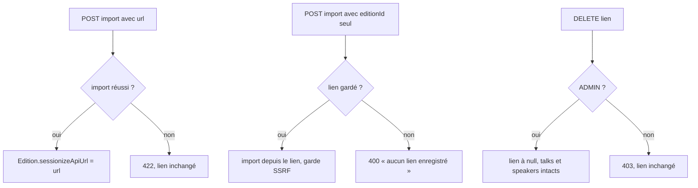
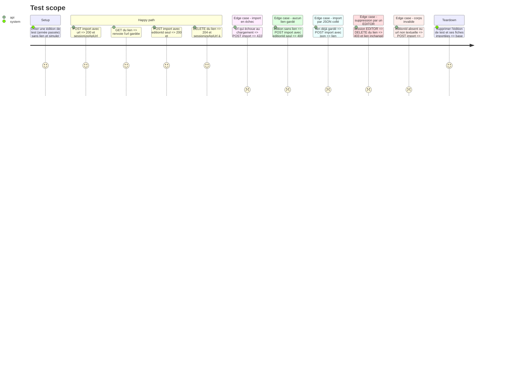

<!-- Fill or omit these sections; never add, rename, or reorder one. -->

# Instruction: Backend — lien Sessionize gardé sur l'édition

## Architecture projection

> Tree of the final files. ✅ create · ✏️ modify · ❌ delete

```txt
src/backend/
├── prisma/
│   ├── schema.prisma                                        ✏️ Edition.sessionizeApiUrl String?
│   └── migrations/20261006100000_edition_sessionize_api_url/
│       └── migration.sql                                    ✅ ALTER TABLE "Edition" ADD COLUMN, écrite à la main
└── src/
    ├── routes/admin/import.ts                               ✏️ schéma du body ; repli sur le lien gardé ; enregistrement après succès ; GET et DELETE du lien
    └── __tests__/admin-import-saved-link.test.ts            ✅ tests de route, chargement Sessionize simulé
```

## User Journey



## Test Scope



## Tasks to do

### `1)` Colonne et migration

> L'édition peut porter son lien d'import.

1. Ajouter `sessionizeApiUrl String?` à `Edition`, avec un commentaire qui la distingue de `cfp_sessionize_url`.
2. Écrire la migration à la main (`ALTER TABLE "Edition" ADD COLUMN "sessionizeApiUrl" TEXT`).
3. `prisma generate` dans le conteneur.

### `2)` Import depuis le lien gardé

> Relancer l'import sans recoller l'URL.

1. Déclarer un JSON Schema sur le body de `POST /import/sessionize` : `editionId` entier ≥ 1 requis, `url` et `json` chaînes bornées.
2. Sans `url` ni `json`, relire `sessionizeApiUrl` ; s'il est vide, 400 « Aucun lien Sessionize enregistré pour cette édition. ».
3. Après un import réussi depuis une `url` fournie, l'enregistrer sur l'édition (canal `IMPORT` déjà posé pour l'historique).

### `3)` Lire et supprimer le lien

> L'onglet sait s'il y a un lien, et peut l'oublier.

1. `GET /import/sessionize/:editionId/source` → `{ url: string | null }`, 404 si l'édition n'existe pas.
2. `DELETE /import/sessionize/:editionId/source` → 204, lien à `null`, rien d'autre touché ; `preHandler: [requireAdminRole]` (décision du 2026-10-06), 403 pour un EDITOR.
3. La lecture reste dans le groupe équipe, comme l'import ; vérifier que `route-guards.test.ts` passe et que l'inventaire de `docs/audit-droits-api.md` est régénéré.

### `4)` Tests

> Prouver chaque comportement, rouge d'abord.

1. `admin-import-saved-link.test.ts` selon le Test Scope, `loadSessionizeData` simulé par `vi.mock` en gardant `importSessionize` réel ; le cas EDITOR passe par le vrai serveur (`buildServer`) avec le contexte d'authentification simulé, comme `admin-sponsor-tiers-roles.test.ts`.
2. Vérifier qu'aucune route publique ne renvoie `sessionizeApiUrl` (`/api/editions`, `/editions/:year`, `/editions/current`).

## Test acceptance criteria

| Task | Acceptance criteria |
| ---- | ------------------- |
| 1 | La migration s'applique sur une base fraîche (`migrate deploy`) et le typecheck passe |
| 2 | Un import réussi depuis une URL garde le lien ; un import en échec ou par JSON ne le change pas ; un import sans URL utilise le lien gardé ou répond 400 en français |
| 3 | Le lien se lit par l'équipe et se supprime par un ADMIN seulement (403 pour un EDITOR) ; la suppression ne touche à aucun talk ni speaker |
| 4 | Les tests passent, et échouaient avant le correctif ; aucune réponse publique ne contient `sessionizeApiUrl` |
