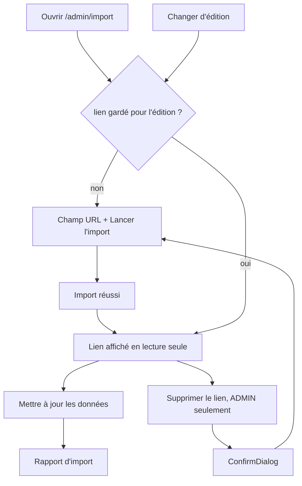
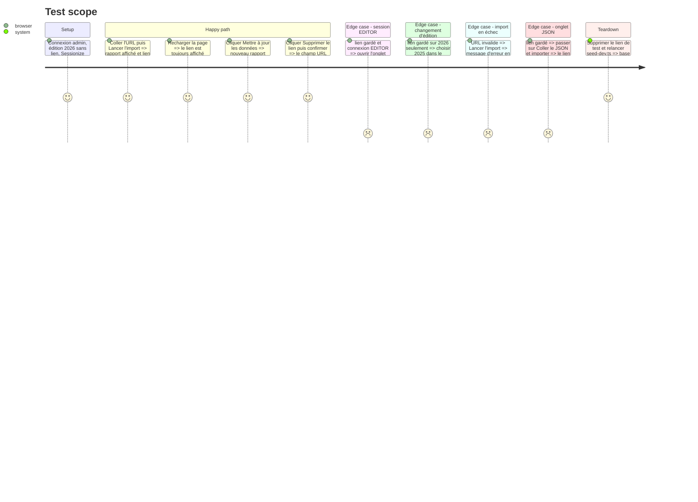

<!-- Fill or omit these sections; never add, rename, or reorder one. -->

# Instruction: Admin — l'onglet d'import utilise le lien gardé

## Architecture projection

> Tree of the final files. ✅ create · ✏️ modify · ❌ delete

```txt
src/frontend/src/
├── lib/admin-api.ts                                   ✏️ adminGetSessionizeSource, adminDeleteSessionizeSource, import sans url
├── components/admin/edition-detail/ImportTab.tsx      ✏️ lien gardé en lecture seule, « Mettre à jour les données », « Supprimer le lien »
└── app/admin/import/page.tsx                          ✏️ key={editionId} sur ImportTab, pour relire le lien à chaque changement d'édition
```

## User Journey



## Test Scope



## Wireframe

```txt
┌──────────────────────────────────────────────────────────────┐
│ (1) Édition cible [2026 ▾]                                    │
├──────────────────────────────────────────────────────────────┤
│ (2) Import Sessionize — texte d'aide                          │
│ (3) [ URL Sessionize ] [ Coller le JSON ]                     │
│ ┌──────────────────────────────────────────────────────────┐ │
│ │ (4) Lien enregistré                                       │ │
│ │     https://sessionize.com/api/v2/…/view/All  (lecture)  │ │
│ │     [ Mettre à jour les données ] [ Supprimer le lien* ]  │ │
│ └──────────────────────────────────────────────────────────┘ │
│   — ou, sans lien enregistré —                                │
│ (5) URL de l'API Sessionize [______________] [Lancer l'import]│
│ (6) Erreur / rapport d'import / absents                       │
│ (7) Association des salles                                    │
└──────────────────────────────────────────────────────────────┘
```

1. Sélecteur d'édition : le lien affiché est toujours celui de l'édition choisie.
2. Texte d'aide existant.
3. Choix de la source, inchangé.
4. Lien gardé en lecture seule et ses actions ; remplace la zone 5 quand il existe. *Supprimer le lien : ADMIN seulement.
5. Saisie actuelle, quand aucun lien n'est gardé.
6. Retours existants : erreur, rapport, absents.
7. Association des salles (#519), inchangée.

## Tasks to do

### `1)` Client API

> Le frontend lit, réutilise et supprime le lien.

1. `adminGetSessionizeSource(editionId)` et `adminDeleteSessionizeSource(editionId)` dans `admin-api.ts`.
2. L'import accepte `{ editionId }` seul pour « Mettre à jour les données ».

### `2)` Onglet d'import

> Le lien gardé remplace la saisie.

1. Charger le lien au montage ; l'afficher en lecture seule avec « Mettre à jour les données », et « Supprimer le lien » (`ConfirmDialog`) pour un ADMIN seulement : rôle lu par `getAdminSession()`, comme la corbeille.
2. Après un import réussi depuis une URL, relire le lien pour basculer sur l'affichage enregistré.
3. Échec de suppression : message qui reste affiché (`forms.md`, #394), succès = statut `204` uniquement (#428).

### `3)` Message d'échec en français

> Un import en échec dit ce qui s'est passé et quoi faire.

1. Sur un 422, afficher « Sessionize n'a pas renvoyé de données exploitables : vérifiez le lien (endpoint « All » de l'événement) puis réessayez. », suivi du détail technique (décision du 2026-10-06).

### `4)` Suivre l'édition choisie

> Jamais le lien d'une autre année.

1. `key={editionId}` sur `ImportTab` dans `app/admin/import/page.tsx`.

### `5)` Vérifier

> Vu marcher avant de pousser.

1. Lint, tests et build frontend.
2. Parcours du Test Scope dans Chrome (MCP), console propre. Le cas EDITOR suppose #530 (lecture des éditions ouverte à l'équipe) : sans lui, la page d'import d'un EDITOR reste vide.

## Test acceptance criteria

| Task | Acceptance criteria |
| ---- | ------------------- |
| 1 | Les appels renvoient le lien gardé, ou `null`, et la suppression répond `204` |
| 2 | Après un import réussi, le lien s'affiche en lecture seule et survit au rechargement ; « Mettre à jour les données » réimporte sans ressaisie ; pour un ADMIN, « Supprimer le lien » demande confirmation puis rend le champ vide ; un EDITOR ne voit pas ce bouton |
| 3 | Un import en échec affiche un message en français suivi du détail technique, et aucun lien n'est gardé |
| 4 | Passer d'une édition à l'autre n'affiche jamais le lien d'une autre édition |
| 5 | Le parcours complet est vu marcher dans Chrome, sans erreur console |
